# SYSTEM ARCHITECTURE SPECIFICATION
## Automated Multi-Stage Brain Tumor MRI Classification, Segmentation, and Reliability Assessment Platform
### Authoritative Production Baseline: Release FINAL-001 (Git Commit: `48dd3ae`) / Maintenance Branch: `final-001` (`ad01b73`)

---

**Document Classification:** Academic Major Project Engineering Architecture & Technical Design Specification  
**Project Identifier:** `BrainTumor-MajorProject`  
**System Version:** Release Baseline `FINAL-001` (`48dd3aeb757ecda15a9bf53665ef7f0adad118c2`)  
**Maintenance Lineage:** Commit `ad01b73` (`CORRECTION-002` documentation integrity update)  
**Lead Engineer / Author:** Senior Systems Architect & ML Engineering Team  
**Academic Guides & Examination Committee:** Major Project Review Board  
**Target Domain:** Applied Machine Learning Systems, Computer Vision, Fault-Tolerant Software Engineering  
**Operating Environment:** Offline-First Application-Layer Deployment (CPU Baseline & NVIDIA T4 GPU Acceleration)  
**Date of Publication:** September 2026  

### Document Revision History

| Revision | Date | Author / Engineering Baseline | Summary of Changes |
| :--- | :--- | :--- | :--- |
| **0.1** | June 2026 | Systems Architecture Team (`ENG-001`) | Initial system architecture specification, functional requirements, and invariant definitions. |
| **0.2** | July 2026 | Systems Architecture Team (`ENG-002`) | Observer-boundary decoupling, reliability synthesis (`REL-001`), and offline verification (`OFF-001`). |
| **1.0** | September 2026 | Core Engineering Baseline (`FINAL-001`, `48dd3ae`) | Authoritative production baseline release; frozen `CLS-001` and `SEG-001` models. |
| **1.1** | September 2026 | Documentation Maintenance (`CORRECTION-002`, `ad01b73`) | Cryptographic manifest synchronization, forensic precision updates, and failure-mode analysis. |

---

### STATUTORY MANDATE AND ENGINEERING BOUNDARY STATEMENT

> **CRITICAL SYSTEM NOTICE & GOVERNANCE BOUNDARY**  
> This document specifies an **applied engineering and software architecture prototype**. It describes an integrated computer-vision pipeline built to investigate deterministic fault handling, calibration, perturbation consistency, and modular inference contracts on magnetic resonance imaging (MRI) slices.  
>  
> 1. **NOT A MEDICAL DEVICE:** The software specified herein is neither certified nor validated as a clinical diagnostic tool, medical decision-support system, or software-as-a-medical-device (SaMD). It must **never** be used for clinical diagnosis, patient triage, surgical planning, or therapeutic monitoring.  
> 2. **NO CLAIM OF CLINICAL VALIDITY:** All reported performance numbers are empirical engineering measurements strictly bounded to the evaluation split of the BRISC 2025 release (`arXiv:2506.14318`). No claims of generalizability across external hospital sites, scanners, or patient demographics are made.  
> 3. **NO CLAIM OF PATIENT-LEVEL INDEPENDENCE:** Because the source dataset lacks complete patient-subject identifiers, slice independence cannot be clinically asserted.  
> 4. **DATA CONTAMINATION DISCLOSURE:** This engineering project explicitly acknowledges, forensically documents, and tracks seven (7) byte-identical cross-split image hashes discovered between the official training and testing sets. The primary locked test set ($N=1000$) and a sensitivity population ($N=993$) are reported jointly. The system is **not** claimed to be "leakage-free."  
> 5. **NO CLAIMS OF SOTA OR SUPERIORITY:** All model choices are defended on grounds of architectural simplicity, computational tractability, parameter efficiency, and auditability. No claim of state-of-the-art (SOTA) performance or superiority over alternative architectures is asserted.

---

## TABLE OF CONTENTS

1. [Document Overview and Structural Index](#1-document-overview-and-structural-index)
2. [Executive Summary](#2-executive-summary)
3. [Project Scope, Framing, and Engineering Objectives](#3-project-scope-framing-and-engineering-objectives)
4. [System Requirements and Traceability Matrix](#4-system-requirements-and-traceability-matrix)
5. [System Architecture Overview and Core Topological Design](#5-system-architecture-overview-and-core-topological-design)
6. [Data Governance and BRISC 2025 Dataset Characteristics](#6-data-governance-and-brisc-2025-dataset-characteristics)
7. [Gate-0 Data Integrity Verification and Contamination Forensics](#7-gate-0-data-integrity-verification-and-contamination-forensics)
8. [Data Partitioning Strategy and Locked Test Set Protection](#8-data-partitioning-strategy-and-locked-test-set-protection)
9. [Classification Architecture (Model CLS-001: ConvNeXt-Tiny)](#9-classification-architecture-model-cls-001-convnext-tiny)
10. [Segmentation Architecture (Model SEG-001: Vanilla U-Net)](#10-segmentation-architecture-model-seg-001-vanilla-u-net)
11. [Deterministic Localization Engine and Coordinate Translation](#11-deterministic-localization-engine-and-coordinate-translation)
12. [Post-Hoc Probability Calibration and Operating Threshold Architecture](#12-post-hoc-probability-calibration-and-operating-threshold-architecture)
13. [Deterministic Input-Quality Gate Architecture (Q01–Q09)](#13-deterministic-input-quality-gate-architecture-q01q09)
14. [Perturbation-Consistency Observer Architecture (UNC-001)](#14-perturbation-consistency-observer-architecture-unc-001)
15. [Reliability Observer Architecture (REL-001)](#15-reliability-observer-architecture-rel-001)
16. [System-State Architecture and Precedence State Machine](#16-system-state-architecture-and-precedence-state-machine)
17. [Explainability and Contribution Visualization (EXPL-001)](#17-explainability-and-contribution-visualization-expl-001)
18. [Unified InferenceService Architecture](#18-unified-inferenceservice-architecture)
19. [Application Programming Interface (API) Architecture](#19-application-programming-interface-api-architecture)
20. [Streamlit Graphical User Interface Architecture](#20-streamlit-graphical-user-interface-architecture)
21. [Offline-First Architecture and Network Isolation Verification (OFF-001)](#21-offline-first-architecture-and-network-isolation-verification-off-001)
22. [Deployment Architecture and Hardware Execution Profiles](#22-deployment-architecture-and-hardware-execution-profiles)
23. [Software Verification Strategy and Continuous Integration Pipeline](#23-software-verification-strategy-and-continuous-integration-pipeline)
24. [Validation Strategy and Locked Empirical Evaluation](#24-validation-strategy-and-locked-empirical-evaluation)
25. [Experimental Architecture Candidates (ROB-001 and GEN-001)](#25-experimental-architecture-candidates-rob-001-and-gen-001)
26. [Release Management, Cryptographic Forensics, and Manifest Auditing](#26-release-management-cryptographic-forensics-and-manifest-auditing)
27. [Performance, Latency, and Memory Footprint Characterization](#27-performance-latency-and-memory-footprint-characterization)
28. [Engineering Limitations and Failure Risk Boundaries](#28-engineering-limitations-and-failure-risk-boundaries)
29. [Future Engineering Extensions (Non-Implemented Roadmap)](#29-future-engineering-extensions-non-implemented-roadmap)
30. [Architecture Synthesis and Academic Review Defense Summary](#30-architecture-synthesis-and-academic-review-defense-summary)
31. [ECE Engineering Relevance and Curriculum Mapping](#31-ece-engineering-relevance-and-curriculum-mapping)

---

## 1. DOCUMENT OVERVIEW AND STRUCTURAL INDEX

This document serves as the formal **System Architecture Specification (SAS)** for the Brain Tumor Major Project, developed under rigorous software engineering guidelines for academic review. The system is designed to provide a cohesive, auditable, and modular software pipeline that ingests two-dimensional (2D) axial, coronal, or sagittal magnetic resonance imaging (MRI) slices and produces:
1. Four-class pathological classification (`glioma`, `meningioma`, `pituitary`, or `notumor`) with calibrated uncertainty metrics;
2. Binary pixel-level segmentation identifying putative neoplastic tissue;
3. Deterministic geometric localization (bounding box coordinates, spatial centroid, and area summation in original input pixel dimensions);
4. Automated input-quality verification (Codes `Q01` through `Q09`);
5. Perturbation-based prediction stability analysis ($K=8$ Gaussian noise probes);
6. Descriptive reliability assessment;
7. Deterministic feature-attribution visualization (Grad-CAM overlays); and
8. A unified, prioritized system state resolving potential diagnostic contradictions.

The document is organized sequentially to reflect standard software and systems engineering lifecycles: **Requirements $\rightarrow$ Architecture $\rightarrow$ Design Decisions $\rightarrow$ Implementation $\rightarrow$ Verification $\rightarrow$ Validation $\rightarrow$ Deployment $\rightarrow$ Limitations $\rightarrow$ Future Work**.

---

## 2. EXECUTIVE SUMMARY

Modern machine learning in biomedical imaging often suffers from severe engineering deficiencies: pipeline fragmentation, duplicate inference logic across user interfaces and APIs, lack of error containment, failure to account for data leakage, uncalibrated probability estimates, and silent catastrophic failures on corrupted inputs.

The Brain Tumor Major Project addresses these engineering challenges directly. Rather than treating deep learning as an isolated modeling exercise, this project implements an **auditable, reproducible, end-to-end software platform** centered around five permanent architectural freezes:

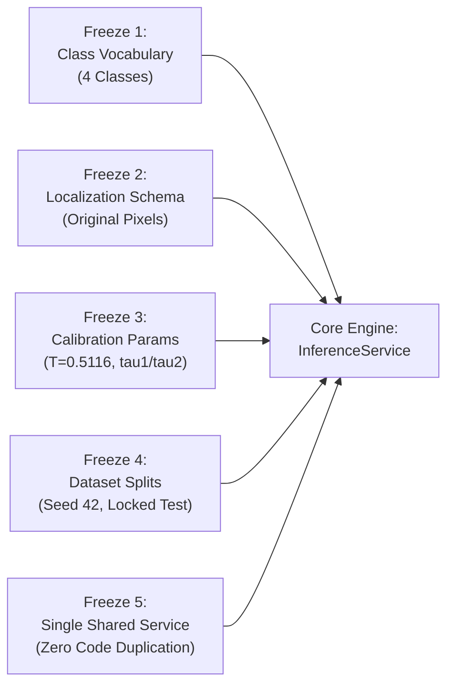

### Key Architectural Characteristics
- **Unified Service Architecture:** Complete elimination of dual codebases. A single core class, `InferenceService`, is imported directly by both the FastAPI backend and the Streamlit graphical interface. Streamlit executes in-process calls without HTTP loopback overhead. Shared model ownership through `InferenceService` ensures that model weights are managed centrally without redundant allocations.
- **Production Models:** 
  - *Classifier (`CLS-001`):* ConvNeXt-Tiny (27.8M parameters), achieving 0.9950 accuracy and 0.995167 macro-F1 on the locked test set ($N=1000$), calibrated via post-hoc temperature scaling ($T \approx 0.5116$) to an Expected Calibration Error (ECE) of 0.002655.
  - *Segmenter (`SEG-001`):* Vanilla U-Net (31.0M parameters), achieving a mean Dice score of 0.8617 (median 0.9385) and an IoU of 0.7934 on the locked evaluation cohort ($N=860$).
- **Observer-Decoupled Reliability:** Engineering safeguards—including deterministic quality gates (`Q01`–`Q09`), perturbation consistency checks (`UNC-001`), and Grad-CAM explanations (`EXPL-001`)—function as non-intrusive observers. They report structured diagnostic metadata without mutating primary model predictions or violating contract invariants.
- **Forensic Rigor:** Contamination across splits (7 byte-identical hashes spanning train and test) is explicitly disclosed. A sensitivity evaluation on $N=993$ cases confirms that system accuracy delta is negligible ($3.5 \times 10^{-5}$).

---

## 3. PROJECT SCOPE, FRAMING, AND ENGINEERING OBJECTIVES

### 3.1 Engineering Paradigm vs. Clinical Diagnostic Claims
Academic machine learning projects frequently conflate computer science prototypes with clinical devices. This specification establishes a strict framing boundary:

| Attribute | Clinical Diagnostic Device (SaMD) | BrainTumor-MajorProject (This System) |
| :--- | :--- | :--- |
| **Intended Use** | Direct diagnosis, surgical guidance, treatment planning | Engineering exploration of robust multi-stage ML inference |
| **Validation Base** | Multi-center prospective clinical trials | Retrospective benchmarking on the static BRISC 2025 corpus |
| **Patient Identification** | Complete longitudinal electronic health records (EHR) | Anonymized slice-level files; complete subject metadata absent |
| **Failure Handling** | Physician-in-the-loop clinical escalation | Structured HTTP error envelopes and descriptive flags |
| **Regulatory Standing**| FDA 510(k), CE mark, or equivalent SaMD clearance | Academic major project prototype; strictly non-clinical |

### 3.2 Primary Engineering Objectives
1. **Deterministic Pipeline Construction:** Ensure deterministic behavior for repeated runs under the same hardware/software environment; cross-hardware behavior is validated at defined tolerances.
2. **Contract Enforceability:** Enforce strict Pydantic data contracts such that invalid or contradictory model states (e.g., claiming a "healthy" state while predicting neoplastic tissue) raise immediate, unhandled validation exceptions during development and cleanly formatted error envelopes in production.
3. **Graceful Degradation:** Support headless execution, missing weight fallbacks, offline-first application-layer operation, and explicit signaling when segmentation models are unavailable.
4. **Transparent Data Auditing:** Demonstrate defensible engineering practices by documenting and isolating data contamination rather than concealing it.

---

## 4. SYSTEM REQUIREMENTS AND TRACEABILITY MATRIX

The system architecture is derived from twelve functional requirements (FR) and eight non-functional requirements (NFR), established during baseline specification (`ENG-001`) and frozen without open gaps.

### 4.1 Functional Requirements (FR)
- **FR-CLS-1 (Classification Vocabulary):** The system shall classify an input 2D MRI slice into exactly one of four canonical labels: `glioma`, `meningioma`, `pituitary`, or `notumor`. Predicted class probabilities must sum to $1.0 \pm 0.01$.
- **FR-CLS-2 (Calibrated Decision Logic):** The system shall apply the frozen temperature scaling constant recorded in `outputs/CLS-001/calibration_frozen.json` (derivation and optimization specified in §12.1) and evaluate calibrated primary confidence $c = \max(\hat{\mathbf{p}})$ and top-2 margin $\Delta = \hat{p}_{(1)} - \hat{p}_{(2)}$ against frozen operational thresholds. A prediction shall be marked `confident` if and only if $c \ge \tau_1$ and $\Delta \ge \tau_2$; otherwise, it shall be marked `uncertain`. Operational thresholds are permanently frozen at $\tau_1 = 0.95$ and $\tau_2 = 0.05$.
- **FR-SEG-1 (Binary Tumor Segmentation):** The system shall output a single-channel binary segmentation mask at an unalterable foreground threshold of $\theta = 0.5$ without morphological post-filtering.
- **FR-LOC-1 (Deterministic Localization):** The system shall extract bounding boxes in integer $[x_{\min}, y_{\min}, x_{\max}, y_{\max}]$ coordinates scaled to original image dimensions, calculate the $(c_x, c_y)$ floating-point centroid of the largest component, and compute total qualifying area ($\ge 10\text{ px}$). Empty masks must return `null` coordinates and 0 area.
- **FR-CON-1 (Perturbation Consistency Observer):** The system shall evaluate prediction stability over $K=8$ Gaussian noise probes ($\sigma=0.05$) under fixed pseudo-random seeds ($7003+k$). A descriptive flag shall be raised if agreement is $< 1.0$. This operates strictly as an empirical perturbation-consistency observer and does not represent formal uncertainty quantification.
- **FR-REL-1 (Reliability Fusion):** The system shall synthesize classification state, consistency fraction, quality verdict, and localization into a structured `stable` or `review` assessment accompanied by an explicit basis list.
- **FR-QLT-1 (Decodable Image Quality Verification):** The system shall evaluate decodable uploads against deterministic algorithmic checks (`Q01`–`Q09`) and report failure codes. In the standard analysis pipeline, this operates as a descriptive observer attached to the payload without mutating the primary prediction.
- **FR-QLT-2 (Interface Boundary Rejection):** The system shall immediately trap and reject structural transfer errors at the transport boundary—specifically payloads exceeding the 10 MB limit (`Q08`) or containing undecodable image bytes (`Q01`)—returning structured HTTP `413` or `422` error envelopes without invoking downstream inference engines.
- **FR-EXP-1 (Feature Attribution):** The system shall provide Grad-CAM heatmaps for the penultimate convolutional block of the classifier, preserving identical model predictions with the uninstrumented pipeline (FP32 execution ensures numerical stability).
- **FR-API-1 (Unified API Endpoints):** The system shall expose nine RESTful endpoints with structured error envelopes (`413`, `415`, `422`, `500`) that prevent stack-trace leakage.
- **FR-UI-1 (Integrated Graphical Interface):** The system shall provide an interactive Streamlit UI utilizing direct in-memory service calls without HTTP loopback.
- **FR-SYS-1 (State Precedence Enforcement):** The system shall derive a singular system state via strict priority: $\text{degraded} > \text{uncertain} > \text{tumor\_unlocalized} > \text{tumor\_localized} > \text{healthy}$.

### 4.2 Non-Functional Requirements (NFR)
- **NFR-REPRO-1 (Cryptographic Manifest):** All model weights, configuration files, and evaluation datasets must be cryptographically hashed (SHA-256) and verifiable via an automated script.
- **NFR-DET-1 (Execution Determinism):** Identical input bytes must produce deterministic inference outputs across repeated runs under the same hardware and software environment.
- **NFR-CPU-1 (Universal CPU Fallback):** The system must execute fully on commodity x86_64 CPU hardware without requiring CUDA libraries.
- **NFR-GPU-1 (Precision Parity):** GPU inference under FP16 Automatic Mixed Precision (AMP) must not degrade validation macro-F1 by more than 0.001 or Dice by more than 0.01 compared to FP32 baselines.
- **NFR-PERF-1 (Latency Budget):** On an NVIDIA T4 GPU, median classification latency must be $\le 0.02\text{s}$, segmentation $\le 0.03\text{s}$, and core end-to-end analysis $\le 0.05\text{s}$.
- **NFR-PORT-1 (Clean Environment Bootstrap):** The codebase must cleanly initialize and pass CI in an isolated environment without pre-existing data caches.
- **NFR-OFF-1 (Offline-First Integrity):** The inference engine must function with external network calls disabled, making zero remote network requests during model loading and inference.
- **NFR-ERR-1 (Typed Error Boundaries):** Unhandled runtime exceptions must be trapped at interface boundaries and converted into typed, non-leaking JSON schemas.

### 4.3 Requirements Traceability Matrix

| Requirement ID | Architectural Subsystem | Source Implementation | Verification Evidence |
| :--- | :--- | :--- | :--- |
| **FR-CLS-1/2** | Classification Engine | `src/brain_tumor/inference/service.py` | `outputs/test_evaluation_7b860dca72ea.json`, `docs/architecture_evidence.md` |
| **FR-SEG-1** | Segmentation Engine | `src/brain_tumor/segmentation/unet.py` | `outputs/SEG-001/metrics.json` |
| **FR-LOC-1** | Localization Engine | `src/brain_tumor/localization/extract.py`| `tests/unit/test_localization.py` |
| **FR-CON-1** | Consistency Observer | `src/brain_tumor/inference/service.py` | `outputs/UNC-001/unc001_locked.json` |
| **FR-REL-1** | Reliability Engine | `src/brain_tumor/reliability/engine.py` | `outputs/REL-001/rel001.json` |
| **FR-QLT-1** | Quality Gate (Observer) | `src/brain_tumor/quality/gate.py` | `outputs/QUALITY/gate_validation.json` |
| **FR-QLT-2** | Quality Gate (Boundary) | `app/api/main.py` | `tests/integration/test_error_envelopes.py` |
| **FR-EXP-1** | Explainability Hook | `src/brain_tumor/explain/gradcam.py` | `outputs/EXPL-001/expl001.json` |
| **FR-API-1** | RESTful Interface | `app/api/main.py` | `tests/integration/test_api.py` |
| **FR-UI-1** | Streamlit Web App | `app/streamlit/app.py` | `tests/integration/test_streamlit.py` |
| **FR-SYS-1** | State Machine Engine | `src/brain_tumor/contracts.py` | `tests/unit/test_contracts.py` |
| **NFR-REPRO-1**| Build Tooling | `scripts/release/build_manifest.py` | `docs/release_manifest.md` |
| **NFR-DET-1** | Inference Pipeline | `service.py` / `engine.py` | `tests/integration/test_determinism.py` |
| **NFR-CPU-1** | Tensor Runtime | PyTorch CPU Execution Subsystem | 49 passed CI tests on CPU |
| **NFR-GPU-1** | Mixed Precision Context| `service.py::_autocast()` | `outputs/SYSINT/fp16_check.json` |
| **NFR-PERF-1** | Deployment Profiler | `scripts/bench/` | `outputs/SYSINT/gpu_latency_fp32.json` |
| **NFR-PORT-1** | Packaging Framework | Repository Structure & Lockfile | Clean Git clone verification |
| **NFR-OFF-1** | Network Subsystem | Socket Guard Interceptor | `docs/off/OFF-001.md` |
| **NFR-ERR-1** | Error Handling Layer | FastAPI Exception Handlers | `tests/integration/test_error_envelopes.py` |

---

## 5. SYSTEM ARCHITECTURE OVERVIEW AND CORE TOPOLOGICAL DESIGN

The system follows a modular, pipe-and-filter design centered around an authoritative core service. Incoming byte arrays undergo deterministic verification before reaching machine learning models, whose outputs are interpreted through post-processing engines and monitored by parallel observers.

### 5.1 High-Level Architectural Topology

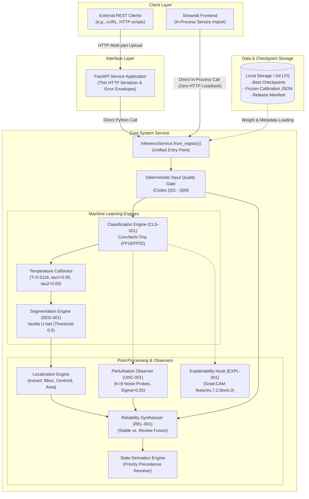

### 5.2 End-to-End Inference Data Flow

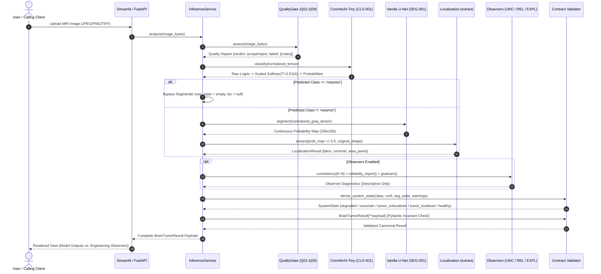

---

## 6. DATA GOVERNANCE AND BRISC 2025 DATASET CHARACTERISTICS

The primary data foundation for this project is the **BRISC 2025** benchmark dataset (`briscdataset/brisc2025`, distributed under CC BY 4.0, documented in `arXiv:2506.14318`).

### 6.1 Dataset Composition and Modality
- **Total Released Images:** 6,000 single-channel 2D MRI slices formatted as JPEGs.
- **Official Partitions:** 5,000 images designated as the official training pool; 1,000 images designated as the official test set.
- **Histopathological Class Distribution (Classification Task):**

| Pathological Class | Official Training Pool ($N=5000$) | Official Test Set ($N=1000$) | Total Image Cohort ($N=6000$) |
| :--- | :--- | :--- | :--- |
| **Glioma** | 1,147 | 254 | 1,401 |
| **Meningioma** | 1,329 | 306 | 1,635 |
| **Pituitary** | 1,457 | 300 | 1,757 |
| **No Tumor (`notumor`)** | 1,067 | 140 | 1,207 |
| **Total Cohort** | **5,000** | **1,000** | **6,000** |

- **Segmentation Task Cohort:** A subset of 4,793 images includes ground-truth pixel-level segmentation masks (3,933 training pairs and 860 testing pairs). Healthy controls (`notumor`) lack neoplastic masks and are excluded from segmentation training by convention.
- **Image Characteristics:** Image dimensions vary from $174 \times 174$ to over $800 \times 800$ pixels across axial, coronal, and sagittal imaging planes. Intensities are distributed non-uniformly across 8-bit unsigned integer channels.

---

## 7. GATE-0 DATA INTEGRITY VERIFICATION AND CONTAMINATION FORENSICS

Prior to training model architectures, the engineering charter required executing **Gate 0**, an automated cryptographic data-integrity audit (`scripts/data/audit_gate0.py`). 

### 7.1 Cross-Split Duplicate Contamination Discovery
Gate 0 computed exact SHA-256 digests across all 6,000 classification images and revealed that the official benchmark distribution contains **cross-split byte-level identity contamination**:
- **Contaminated Hash Groups:** Exactly seven (7) unique SHA-256 byte hashes appear simultaneously in the official training pool and the official test set.
- **Affected Files:** These 7 hashes correspond to nine (9) physical files in the training set and seven (7) physical files in the locked test set.
- **Segmentation Impact:** Exactly the same seven image identities span the segmentation training and testing splits. Ground-truth masks for these images were verified to have zero duplicate hash overlap.
- **Intra-Training Redundancy:** Audit tooling identified 35 internal duplicate hash groups within the training set, accounting for 38 redundant files (yielding 5,950 strictly unique image hashes across the entire 6,000-image release).

### 7.2 Gate-0 Engineering Disposition and Conditional Pass
Under strict zero-tolerance criteria, cross-split duplication represents a data validation failure. However, rather than manipulating the benchmark or discarding official splits, the project adopted a **formal conditional-pass protocol**:

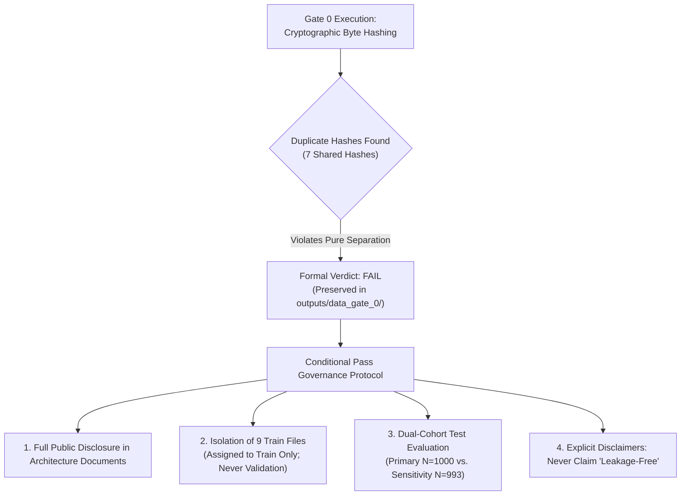

### 7.3 Contaminated Test Case Registry
The seven contaminated test images are permanently tracked via `outputs/data_gate_0/cross_split_exclusion_list.json`:
1. `brisc2025_test_00344_me_ax_t1.jpg` (meningioma)
2. `brisc2025_test_00352_me_ax_t1.jpg` (meningioma)
3. `brisc2025_test_00737_pi_ax_t1.jpg` (pituitary)
4. `brisc2025_test_00751_pi_ax_t1.jpg` (pituitary)
5. `brisc2025_test_00825_pi_co_t1.jpg` (pituitary)
6. `brisc2025_test_00827_pi_co_t1.jpg` (pituitary)
7. `brisc2025_test_00834_pi_co_t1.jpg` (pituitary)

---

## 8. DATA PARTITIONING STRATEGY AND LOCKED TEST SET PROTECTION

### 8.1 Partitioning Methodology
To guarantee that model selection remained untainted by the test cohort or duplicate hash groups, the 5,000-image training pool was partitioned using an **exact subset-sum dynamic programming (DP) algorithm** under fixed random seed 42:
- **Unit of Partitioning:** SHA-256 hash identities (atomic groups). Images sharing identical byte hashes were forced into the same partition, preventing intra-split leakage between training and validation.
- **Contamination Quarantine:** The nine contaminated training files were assigned to the project training partition during hash-quarantined re-partitioning, keeping the project validation partition free of test-identical identities.
- **Stratification:** Stratified across pathological classes and acquisition planes.
- **Final Partition Allocations:**
  - **Project Training Set:** Exactly 4,000 images (3,148 segmentation pairs).
  - **Project Validation Set:** Exactly 1,000 images (785 segmentation pairs).
  - **Locked Test Set:** Exactly 1,000 images (860 segmentation pairs), kept protected during model development.

### 8.2 Test-Set Locking Mechanism
The project enforced a strict test-set lock / one-way evaluation gate (`configs/deployment/test_lock.yaml`). Hyperparameters, training epochs, loss functions, calibration temperatures, and operating thresholds were fitted **exclusively on validation data**. The locked production evaluation was performed under a one-way test gate with no subsequent test-driven tuning.

---

## 9. CLASSIFICATION ARCHITECTURE (MODEL CLS-001: CONVNEXT-TINY)

### 9.1 Architectural Specification
The production classification subsystem utilizes **ConvNeXt-Tiny**, a modernized hierarchical pure-convolutional architecture chosen for its computational efficiency, deterministic convolutional receptive fields, and empirical baseline performance in prior controlled BRISC evaluations (documented in `docs/architecture_evidence.md`).

#### Historical Architecture Exploration Record (BRISC Dataset)
Prior to locking `CLS-001`, historical exploratory evaluations benchmarked six candidate backbones across controlled seeds ($42, 43, 44$) to prioritize candidate selection:

| Candidate ID | Architecture Backbone | Pretrained Initialization | Historical Val Macro-F1 | Empirical Observation / Selection Note |
| :--- | :--- | :--- | :--- | :--- |
| **C0** | Custom Scratch CNN | None (Random init) | 0.6600 | Negative baseline control; insufficient capacity |
| **C1** | ResNet-50 | ImageNet-1K | 0.9925 | Standard residual baseline; higher parameter footprint |
| **C2** | EfficientNet-B0 | ImageNet-1K | 0.9903 | Susceptible to large perturbation drop ($\sigma=0.01$ dropped F1 to 0.2225) |
| **C3** | DenseNet-121 | ImageNet-1K | 0.9945 | Strong feature reuse; prioritized future comparator |
| **C4** | **ConvNeXt-Tiny (`CLS-001`)**| ImageNet-1K | **0.9967** | Selected baseline: descriptive rank 1; modern 7x7 depthwise convs |
| **C5** | Swin-Tiny | ImageNet-1K | 0.9950 | Hierarchical vision transformer; higher latency overhead |

> **STATISTICAL AND TRANSFERABILITY CAVEATS (`docs/architecture_evidence.md`):**  
> 1. **Statistical Indistinguishability:** Statistical hypothesis testing (seed-stratified McNemar exact $p \in [0.727, 1.000]$ and permutation tests $p \in [0.72, 1.00]$) confirms that candidates C4 (ConvNeXt-Tiny), C3 (DenseNet-121), and C5 (Swin-Tiny) were **statistically indistinguishable** at $n=3$ seeds. Ranking is descriptive only; no claim of intrinsic architectural superiority or state-of-the-art (SOTA) performance is supported.  
> 2. **Independent Training Regime:** Historical numbers served strictly to guide candidate prioritization. Release `FINAL-001` trained `CLS-001` from scratch on the newly established, hash-quarantined $4000/1000$ split under its own frozen configuration (`configs/experiment/CLS-001.yaml`), with label smoothing ($\epsilon=0.1$) and temperature calibration.

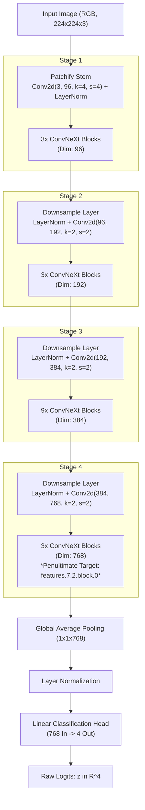

### 9.2 Training Hyperparameters and Regularization
- **Weight Initialization:** ImageNet-1K pretrained weights loaded prior to fine-tuning.
- **Loss Function:** Cross-Entropy Loss with Label Smoothing ($\epsilon = 0.1$):
- **Class Balance & Reweighting Decision:** Class imbalance in the frozen 4,000-image production training partition was modest (maximum/minimum class count ratio $\approx 1.37$, spanning 1,167 pituitary, 1,064 meningioma, 917 glioma, and 852 non-tumor slices). In accordance with the frozen baseline configuration (`configs/experiment/CLS-001.yaml`), no explicit inverse-frequency loss weighting was applied; unweighted cross-entropy with uniform label smoothing ($\epsilon=0.1$) was retained.
- **Optimization:** AdamW ($\beta_1 = 0.9, \beta_2 = 0.999, \text{weight decay} = 0.05$).
- **Learning Rate Schedule:** Initial learning rate $\eta_0 = 3 \times 10^{-4}$ with a 3-epoch linear warmup, followed by cosine annealing decay toward $1 \times 10^{-6}$.
- **Numerical Safeguards:** Gradient clipping at a maximum $L_2$ norm of $1.0$; Automatic Mixed Precision (AMP) with finite-value checks trapping non-finite gradients.
- **Early Stopping:** Monitored on validation macro-F1 with a patience of 8 epochs. Training terminated at epoch 14 of 30, selecting the epoch-14 checkpoint (`checkpoints/CLS-001/best.pt`).

---

## 10. SEGMENTATION ARCHITECTURE (MODEL SEG-001: VANILLA U-NET)

### 10.1 Architectural Specification
The segmentation subsystem utilizes a classic **Vanilla U-Net**. This architecture was selected deliberately over complex attention or transformer variants because its localized convolutions provide transparent, auditable feature extraction suitable for auditable engineering baselines.

```mermaid
flowchart TD
    subgraph Contracting Path (Encoder)
        InImg["Input Slice (Grayscale, 256x256x1)"] --> E1["DoubleConv (1 -> 64)"]
        E1 --> MP1["MaxPool 2x2"] --> E2["DoubleConv (64 -> 128)"]
        E2 --> MP2["MaxPool 2x2"] --> E3["DoubleConv (128 -> 256)"]
        E3 --> MP3["MaxPool 2x2"] --> E4["DoubleConv (256 -> 512)"]
        E4 --> MP4["MaxPool 2x2"] --> B["Bottleneck DoubleConv (512 -> 1024)"]
    end

    subgraph Expansive Path (Decoder)
        B --> UP1["ConvTranspose2d (1024 -> 512)"]
        UP1 -.-> Cat1["Concat Skip Connection"]
        E4 -.-> Cat1
        Cat1 --> D1["DoubleConv (1024 -> 512)"]
        
        D1 --> UP2["ConvTranspose2d (512 -> 256)"]
        UP2 -.-> Cat2["Concat Skip Connection"]
        E3 -.-> Cat2
        Cat2 --> D2["DoubleConv (512 -> 256)"]
        
        D2 --> UP3["ConvTranspose2d (256 -> 128)"]
        UP3 -.-> Cat3["Concat Skip Connection"]
        E2 -.-> Cat3
        Cat3 --> D3["DoubleConv (256 -> 128)"]
        
        D3 --> UP4["ConvTranspose2d (128 -> 64)"]
        UP4 -.-> Cat4["Concat Skip Connection"]
        E1 -.-> Cat4
        Cat4 --> D4["DoubleConv (128 -> 64)"]
    end

    D4 --> FinalConv["Conv2d (64 -> 1, kernel=1)"]
    FinalConv --> Sigmoid["Sigmoid Activation"]
    Sigmoid --> ProbMap["Probability Map in [0, 1]^(256x256)"]
    ProbMap --> Threshold["Hard Thresholding (>= 0.5)"]
    Threshold --> BinaryMask["Binary Mask {0, 1}^(256x256)"]
```

### 10.2 Parameter Profile and Loss Formulation
- **Total Parameters:** Exactly 31,036,481 parameters (all finite floating-point values).
- **Loss Formulation:** Equal-weighted sum of Soft Dice Loss and Binary Cross-Entropy (BCE):
  $$\mathcal{L}_{\text{total}} = \mathcal{L}_{\text{BCE}}(p, y) + \mathcal{L}_{\text{Dice}}(p, y)$$
  $$\mathcal{L}_{\text{Dice}}(p, y) = 1 - \frac{2 \sum_{i} p_i y_i + \epsilon}{\sum_{i} p_i + \sum_{i} y_i + \epsilon}, \quad \epsilon = 1.0$$
- **Convergence:** Trained across 30 complete epochs on an NVIDIA T4; optimal validation Dice achieved at epoch 27.
- **Normalization Invariant:** Standardized using exact channel statistics calculated across the segmentation training partition ($\mu = 0.10168, \sigma = 0.14064$).

---

## 11. DETERMINISTIC LOCALIZATION ENGINE AND COORDINATE TRANSLATION

Localization in this system is strictly derived from the output of the segmentation model rather than relying on a separate regression network (such as YOLO or Faster R-CNN). This guarantees structural coherence between segmented masks and bounding coordinates.

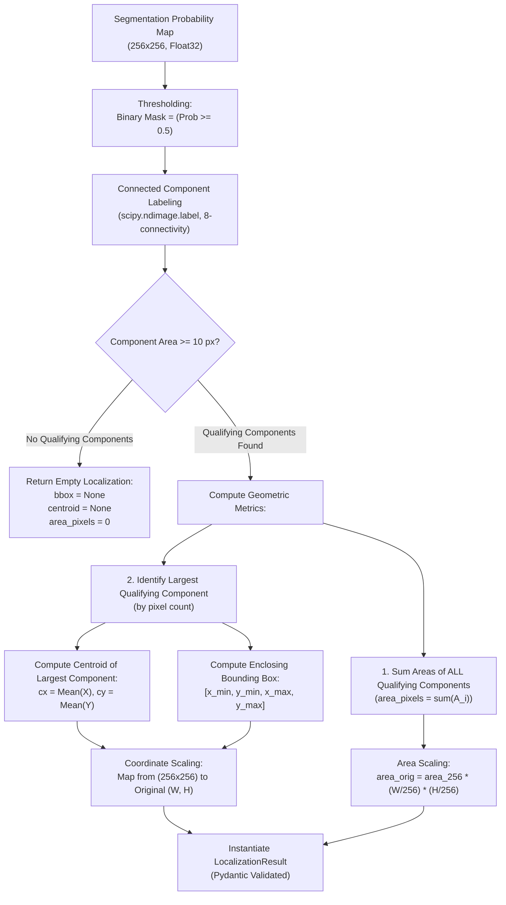

### 11.1 Coordinate Translation Mathematics
Given an input MRI slice of original dimensions $(W, H)$ processed at network resolution $(W_{\text{net}}, H_{\text{net}}) = (256, 256)$, coordinate mapping occurs as follows:
$$x_{\text{orig}} = x_{\text{net}} \times \left( \frac{W}{W_{\text{net}}} \right), \quad y_{\text{orig}} = y_{\text{net}} \times \left( \frac{H}{H_{\text{net}}} \right)$$
Bounding boxes are clamped to image boundaries and cast to standard integers:
$$\text{bbox} = \left[ \lfloor x_{\min} \rfloor, \lfloor y_{\min} \rfloor, \lceil x_{\max} \rceil, \lceil y_{\max} \rceil \right]$$

---

## 12. POST-HOC PROBABILITY CALIBRATION AND OPERATING THRESHOLD ARCHITECTURE

Raw neural network logits tend to produce overconfident probability estimates. To ensure meaningful confidence scoring, the classification engine integrates post-hoc temperature scaling and dual operating thresholds fitted strictly on validation data.

### 12.1 Temperature Scaling Optimization
Raw logits $\mathbf{z} \in \mathbb{R}^4$ are calibrated via temperature parameter $T > 0$:
$$\hat{p}_i = \frac{\exp(z_i / T)}{\sum_{j=1}^4 \exp(z_j / T)}$$
The one-dimensional temperature parameter was optimized using L-BFGS optimization on validation negative log-likelihood (NLL) over the 1,000 validation cases (`src/brain_tumor/classification/calibrate.py`):
$$T^* = \arg\min_T \left( -\sum_{k=1}^{N_{\text{val}}} \log \hat{p}_{y_k}(T) \right) \implies \mathbf{T = 0.511595 \approx 0.5116}$$

#### Numerical Softmax Stability
In runtime execution (`src/brain_tumor/inference/service.py`), softmax probabilities are computed using a numerically stable log-sum-exp formulation (subtracting the maximum scaled logit prior to exponentiation) to prevent floating-point overflow or underflow when logits are scaled by $1/T \approx 1.9547$.

#### Probability Sharpening Interpretation ($T < 1$)
In classical literature, temperature scaling often yields $T > 1$ when models are overconfident, flattening the softmax distribution. In contrast, $T = 0.511595 < 1$ represents **probability sharpening**. Validation NLL minimization selected a temperature less than unity because the raw uncalibrated logits were under-concentrated relative to empirical validation frequencies. Scaling logits by $1/T \approx 1.9547$ sharpens the softmax output distribution so that high-confidence predictions reflect true empirical accuracy. This reduced validation Expected Calibration Error (ECE) to $0.00205$, which generalized to an ECE of $0.002655$ on the locked test set. 

*Engineering Boundary Note:* This behavior is reported as an empirical observation of NLL optimization under validation dynamics. The project does not assert speculative causal claims (such as attributing under-confidence to label smoothing or regularization) without isolated ablation evidence.

### 12.2 Dual Decision Thresholds ($\tau_1, \tau_2$)
Classification predictions are assigned a categorical confidence state based on two frozen operational thresholds:
$$\text{classification\_state} = \begin{cases} 
\text{confident}, & \text{if } \hat{p}_{(1)} \ge \tau_1 \text{ and } (\hat{p}_{(1)} - \hat{p}_{(2)}) \ge \tau_2 \\ 
\text{uncertain}, & \text{otherwise} 
\end{cases}$$
- $\tau_1 = 0.95$ (Minimum primary class confidence)
- $\tau_2 = 0.05$ (Minimum top-2 probability margin)

---

## 13. DETERMINISTIC INPUT-QUALITY GATE ARCHITECTURE (Q01–Q09)

To prevent processing unreadable, corrupted, or anomalous uploads, the system implements a deterministic quality gate (`src/brain_tumor/quality/gate.py`). These checks use fixed heuristics and execute in $< 5\text{ms}$ on CPU without neural networks.

| Code | Check Name | Formal Failure Condition | Engineering Rationale |
| :--- | :--- | :--- | :--- |
| **`Q01`** | `undecodable` | PIL fails to open byte stream | Corrupted file header, truncated transmission |
| **`Q02`** | `unreadable_pixels` | NumPy array conversion fails | Corrupted or unreadable image payload |
| **`Q03`** | `too_small` | $\min(W, H) < 64\text{ px}$ | Prevents processing thumbnails or icons |
| **`Q04`** | `nonfinite` | Any pixel value is `NaN` or `Inf` | Traps numerical corruption before tensor ops |
| **`Q05`** | `blank_or_uniform` | $\sigma_{\text{img}} < 1.0 \lor (\max - \min) < 8.0$ | Catches blank, flat, or uniform images |
| **`Q06`** | `intensity_out_of_range` | $\mu_{\text{img}} < 2.0 \lor \mu_{\text{img}} > 253.0$ | Catches all-black or saturated all-white images |
| **`Q07`** | `insufficient_content` | Fraction of pixels $(> 10.0) < 0.02$ | Rejects scans missing anatomical tissue |
| **`Q08`** | `size_limit` | File size $> 10\text{ MB}$ ($10,485,760\text{ B}$) | Guards against memory exhaustion and DoS |
| **`Q09`** | `extreme_aspect` | $\max(W, H) / \min(W, H) > 8.0$ | Rejects severe aspect-ratio distortions |

### Threshold Calibration and Empirical Origins (Q05–Q07)
The quantitative bounds for checks `Q05`, `Q06`, and `Q07` were established as heuristic engineering thresholds and verified against the 1,000-image validation cohort:
- **`Q05` (`blank_or_uniform`, $\sigma_{\text{img}} < 1.0 \lor \max - \min < 8.0$):** Sourced from the noise floor of standard MRI digitization. Validated to ensure that real MRI backgrounds (which exhibit thermal Rician/Gaussian noise with $\sigma > 2.5$) are never falsely flagged, while synthetic uniform fields or transmission cutoffs are captured.
- **`Q06` (`intensity_out_of_range`, $\mu_{\text{img}} < 2.0 \lor \mu_{\text{img}} > 253.0$):** Set at the extreme dynamic bounds of 8-bit grayscale space to trap completely uncalibrated sensor blackouts or severe amplifier saturation.
- **`Q07` (`insufficient_content`, $\text{fraction}(> 10.0) < 0.02$):** Calibrated to ensure that peripheral skull/brain slices containing minimal tissue are accommodated while rejecting blank or nearly blank frames where tissue accounts for less than 2% of the pixel area.

### Operational Implementation Behavior
In the current system implementation (`src/brain_tumor/quality/gate.py`, `service.py`, and `app/api/main.py`), the quality gate operates in a dual mode:
1. **In the Core Analysis Pipeline (`service.analyze`):** The image is classified and segmented; quality checks evaluate raw upload bytes and attach a structured quality report (`verdict`: `accept` | `reject`, and `failed`: `[Qxx, ...]`) to the payload as non-blocking descriptive metadata. Quality failures do **not** alter the derived `system_state` or unilaterally abort execution.
2. **At the Transport Boundary (`app/api/main.py`):** Structural transfer violations—specifically byte streams exceeding the 10 MB limit (`Q08` / `FR-QLT-2`) or undecodable image payloads (`Q01` / `FR-QLT-2`)—are trapped at the HTTP boundary, returning `413 file_too_large` or `422 undecodable_image` without invoking downstream PyTorch engines.
3. **Dedicated Quality Endpoint (`/quality`):** Directly returns the deterministic verdict and failure list without running classification or segmentation.

### Empirical Validation Evidence
- **False-Positive Rejection Rate:** Exactly $0 / 1000$ clean validation scans rejected ($100\%$ specificity on valid MRIs).
- **Fault-Detection Rate:** Successfully detected $8 / 9$ synthetic corruption scenarios.
- **Known Boundary Condition:** Pure Gaussian noise added to an empty image can pass low-level pixel summary statistics ($\mu, \sigma$) and clear the gate. This highlights the architectural limitation that heuristic quality gates cannot substitute for semantic out-of-distribution detectors.

---

## 14. PERTURBATION-CONSISTENCY OBSERVER ARCHITECTURE (UNC-001)

Rather than providing formal uncertainty quantification or clinical confidence intervals, **UNC-001 operates as a deterministic perturbation-consistency observer** designed to assess empirical prediction stability under controlled additive Gaussian noise.

### Mathematical Formulation and Noise Domain
Given an input image $I$, the clean forward pass yields the primary predicted class $c^* = \text{argmax}(\hat{\mathbf{p}})$. The observer evaluates $K=8$ independent perturbation probes:
1. **Noise Injection Domain:** For each probe $k \in \{0, \dots, K-1\}$, additive pseudo-random Gaussian noise $\boldsymbol{\epsilon}_k \sim \mathcal{N}(0, \sigma^2 \mathbf{I})$ with standard deviation $\sigma = 0.05$ is generated using fixed deterministic seeds ($S_k = 7003 + k$).
2. **Domain Transformation:** The noise is injected directly into the normalized floating-point image array in the $[0, 1]$ intensity domain:
   $$\tilde{I}_k = \text{clip}\left( I + \boldsymbol{\epsilon}_k, 0.0, 1.0 \right)$$
3. **Tensor Pipeline:** The perturbed array $\tilde{I}_k$ is subsequently converted to a PyTorch tensor and normalized using standard ImageNet mean and variance before executing the classifier forward pass to yield probe prediction $c_k$.
4. **Agreement Metric:** The agreement fraction $\alpha$ measures probe stability:
   $$\alpha = \frac{1}{K} \sum_{k=0}^{K-1} \mathbb{I}(c_k = c^*)$$
   If $\alpha < 1.0$, the observer raises a descriptive `perturbation_inconsistency` flag.

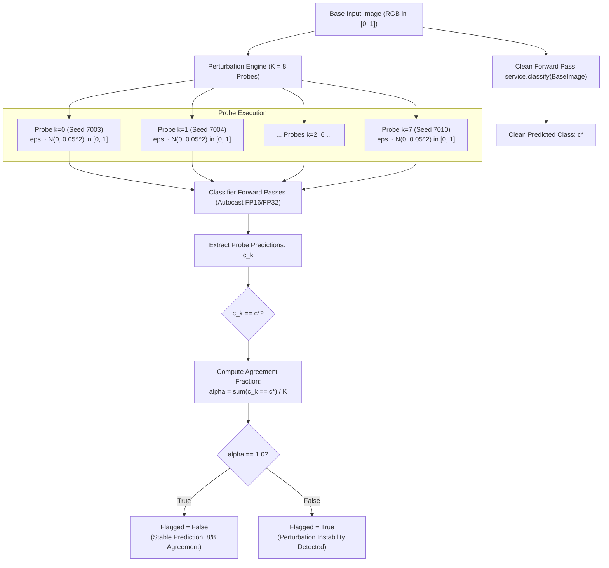

### Empirical Verification on Locked Test Set ($N=1000$)
The detection fidelity of UNC-001 was evaluated against the locked test set under an eval-noise stress-test protocol ($\sigma = 0.05$):

#### 2x2 Noise-Error Detection Contingency Matrix

| Perturbation Observer Status | Perturbation Error (True Error) | Perturbation Invariant (No Error) | Total Cases |
| :--- | :--- | :--- | :--- |
| **Consistency Flagged ($\alpha < 1.0$)** | **$25$ (True Positive, TP)** | **$11$ (False Positive, FP)** | **$36$** (Flag Rate: $3.60\%$) |
| **Consistency Unflagged ($\alpha = 1.0$)**| **$2$ (False Negative, FN)** | **$962$ (True Negative, TN)** | **$964$** |
| **Total Test Cases** | **$27$** | **$973$** | **$1000$** |

#### Detector Performance Characteristics
- **Precision:** $25 / 36 = \mathbf{69.44\%}$
- **Recall (Error Sensitivity):** $25 / 27 = \mathbf{92.59\%}$
- **Detector F1-Score:** $\mathbf{79.49\%}$
- **False Positive Rate (FPR):** $11 / 973 = \mathbf{1.13\%}$
- **Confident-But-Wrong (CBW) Capture:** For 25 instances where the perturbed model was confident yet produced an incorrect label, the observer flagged **24 out of 25** ($96.0\%$).
- **Comparison Against Softmax Thresholding:** Conventional unperturbed confidence thresholding caught only **5 out of 27** errors ($18.52\%$), demonstrating that empirical perturbation probes expose decision boundary proximity that single-pass confidence fails to detect.
- **Architectural Boundary:** The observer functions purely descriptively; consistency flags are emitted as diagnostic metadata and do not mutate `classification_state` or `system_state`.

---

## 15. RELIABILITY OBSERVER ARCHITECTURE (REL-001)

The reliability engine (`src/brain_tumor/reliability/engine.py`) synthesizes diagnostics into an operational summary without overriding underlying model inferences or mutating system states.

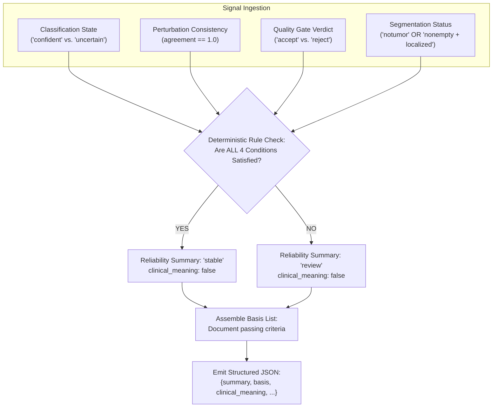

### Fixed Reliability Rule Set
The summary is marked `stable` if and only if:
1. Classification state is `confident` ($c \ge 0.95, \Delta \ge 0.05$);
2. Consistency probe agreement is $1.0$ ($8/8$ match);
3. Input-quality verdict is `accept`; and
4. Either the predicted class is `notumor`, or the mask is `nonempty` with spatial area $> 0\text{ px}$.
Failure on any condition yields a `review` status, with specific failing mechanisms recorded in an explicit `basis` array. `clinical_meaning` is permanently hardcoded to `False`.

---

## 16. SYSTEM-STATE ARCHITECTURE AND PRECEDENCE STATE MACHINE

To prevent semantic contradictions—such as localized predictions on uncalibrated scans or healthy classifications with active segmentations—the system evaluates outputs through a **rigid precedence state machine**:

$$\text{degraded} \succ \text{uncertain} \succ \text{tumor\_unlocalized} \succ \text{tumor\_localized} \succ \text{healthy}$$

### Engineering Rationale for State Precedence Priority
The strict ordering is designed around **software contract-level capability prioritization** rather than clinical severity:
1. **`degraded` (Highest Precedence — Subsystem Availability):** If the segmentation model fails to initialize or its weights are missing, the system cannot fulfill its full two-stage inference contract. Marking the state as `degraded` immediately signals that spatial delineation was bypassed, preventing callers from interpreting missing masks as negative findings.
2. **`uncertain` (Classification Calibration Boundary):** Triggered when calibrated primary confidence or top-2 margin falls below operational thresholds ($c < 0.95 \lor \Delta < 0.05$). If classification validity cannot be assured, downstream spatial delineation cannot be verified. Prioritizing `uncertain` over tumor detection prevents downstream consumers from trusting uncalibrated predictions.
3. **`tumor_unlocalized` (Cross-Model Discrepancy Containment):** Handles instances where the classifier predicts a neoplastic pathology with high confidence ($c \ge 0.95, \Delta \ge 0.05$), but the segmentation model produces an empty mask ($\text{area} = 0$). Emitting `tumor_unlocalized` explicitly flags this structural disagreement rather than masking the failure.
4. **`tumor_localized` (Verified Spatial Agreement):** Assigned when both stages agree: confident neoplastic classification accompanied by a qualifying, non-empty segmentation mask ($\text{area} \ge 10\text{ px}$).
5. **`healthy` (Lowest Precedence — Baseline Negative Invariant):** Represents the non-pathological state. Strictly requires `predicted_class == 'notumor'`, zero segmented area, and null localization coordinates. Any active segmentation or classification uncertainty strictly invalidates a `healthy` verdict.

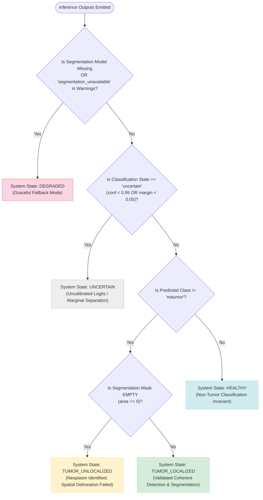

### Pydantic Contract Invariant Rules
The `BrainTumorResult` contract enforces the following validations:
- **`healthy`:** Requires `predicted_class == 'notumor'`, zero area, and `None` bounding boxes.
- **`tumor_localized`:** Requires `predicted_class != 'notumor'`, `segmentation_state == 'nonempty'`, and `area_pixels > 0`.
- **`tumor_unlocalized`:** Requires `predicted_class != 'notumor'`, `segmentation_state == 'empty'`, and `area_pixels == 0`.
- **`degraded`:** Requires the presence of the `segmentation_unavailable` warning flag.
- **`uncertain`:** Requires `classification_state == 'uncertain'`.

---

## 17. EXPLAINABILITY AND CONTRIBUTION VISUALIZATION (EXPL-001)

The explainability subsystem (`EXPL-001`) implements Gradient-weighted Class Activation Mapping (Grad-CAM) as an engineering observer on the classifier.

```mermaid
flowchart LR
    InputTensor["Input Image Tensor (1x3x224x224)"] --> ConvNeXt["ConvNeXt-Tiny Feature Backbone"]
    ConvNeXt --> TargetLayer["features.7.2.block.0<br/>(Final 7x7 Conv Block)"]
    
    TargetLayer --> ForwardAct["Forward Activations: A^k"]
    TargetLayer --> Head["Classification Head"] --> Score["Class Score: y^c"]
    
    Score --> Backward["Backpropagate Gradient:<br/>dy^c / dA^k"]
    Backward --> GlobalPool["Global Average Pooling:<br/>alpha_k = (1/Z) sum(dy^c / dA^k)"]
    
    ForwardAct --> LinearComb["Linear Combination:<br/>sum(alpha_k * A^k)"]
    GlobalPool --> LinearComb
    LinearComb --> ReLU["Rectified Linear Unit (ReLU)"]
    ReLU --> Heatmap["Raw Heatmap (7x7)"]
    Heatmap --> Bilinear["Bilinear Upsampling -> (Original W, H)"]
    Bilinear --> AlphaBlend["Alpha-Blend with Input Scan"]
    AlphaBlend --> VisualOutput["Rendered Visualization & Base64 PNG"]
```

### Explainability Operational Invariants
1. **Mathematical Grounding:** Computes the gradient of score $y^c$ with respect to feature activation maps $A^k$ of layer `features.7.2.block.0`:
   $$\alpha_k^c = \frac{1}{Z} \sum_{i} \sum_{j} \frac{\partial y^c}{\partial A_{i, j}^k}, \quad L_{\text{Grad-CAM}}^c = \text{ReLU}\left( \sum_k \alpha_k^c A^k \right)$$
2. **Hook Lifecycle Management:** PyTorch forward and backward hooks are registered dynamically and guaranteed to detach via `finally` blocks, preventing memory leaks.
3. **Inference Invariance:** To maintain determinism and prevent numerical drift from half-precision gradient approximations, Grad-CAM operations execute in FP32 on all hardware targets. Model predictions remain identical whether explainability hooks are active or inactive.
4. **Spatial Overlap Metric:** The system calculates the proportion of activation mass located within the segmented bounding box:
   $$\text{cam\_mass\_in\_bbox} = \frac{\sum_{(x,y) \in \text{bbox}} L_{\text{Grad-CAM}}(x, y)}{\sum_{(x,y) \in \text{image}} L_{\text{Grad-CAM}}(x, y)}$$
   This metric is reported as an engineering alignment check without asserting clinical causality.

---

## 18. UNIFIED INFERENCESERVICE ARCHITECTURE

The core engine is encapsulated in `InferenceService` (`src/brain_tumor/inference/service.py`), which centralizes inference logic across all presentation layers.

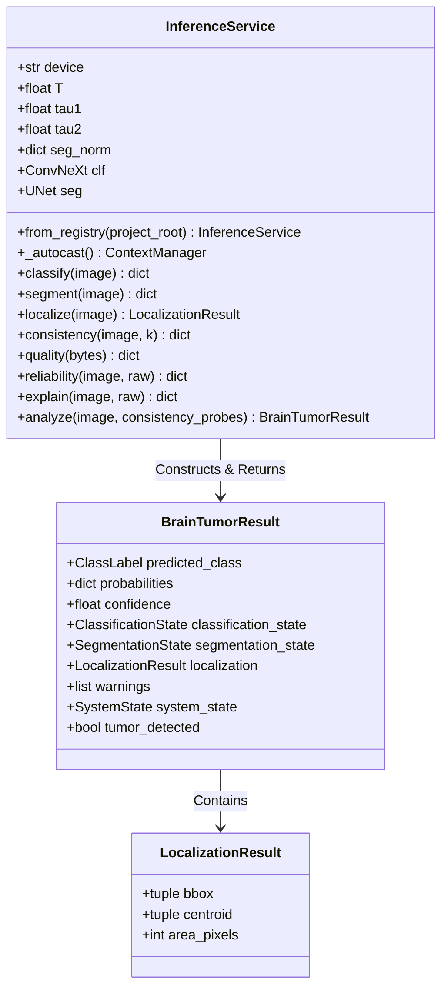

### Key Engineering Invariants
- **Shared Model Ownership:** Model instances (`self.clf` and `self.seg`) are managed centrally within the `InferenceService` instance. Both the FastAPI routing layer and the Streamlit frontend reference this shared service instance, avoiding redundant model instantiations across interfaces.
- **Hardware-Aware Mixed Precision:** The `_autocast()` helper dynamically applies `torch.autocast(device_type="cuda", dtype=torch.float16)` when executing on GPU, falling back to a no-op null context on CPU.
- **Decoupled Primitives:** Primitives (`classify`, `segment`, `localize`, `quality`, `consistency`, `reliability`, `explain`) can be invoked independently, while `analyze` coordinates the canonical end-to-end execution flow.

---

## 19. APPLICATION PROGRAMMING INTERFACE (API) ARCHITECTURE

The RESTful interface is implemented via FastAPI (`app/api/main.py`) as a thin HTTP serialization layer over `InferenceService`.

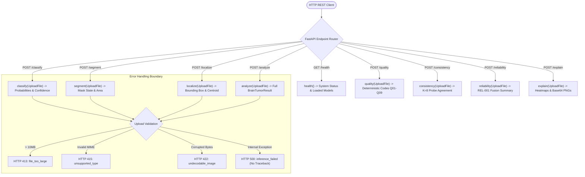

### API Endpoint Registry

| Endpoint | Method | Input Payload | Output Schema | HTTP Status Codes |
| :--- | :--- | :--- | :--- | :--- |
| `/health` | `GET` | None | Service status, model availability, calibration constants | `200` |
| `/classify` | `POST` | Multipart image file | Class probabilities, predicted label, confidence, state | `200`, `413`, `415`, `422`, `500` |
| `/segment` | `POST` | Multipart image file | Mask state (`empty`/`nonempty`), localization, warnings | `200`, `413`, `415`, `422`, `500` |
| `/localize` | `POST` | Multipart image file | Integer bbox coordinates, centroid, pixel area | `200`, `413`, `415`, `422`, `500` |
| `/quality` | `POST` | Multipart image file | Verdict (`accept`/`reject`), failed checks (`Q01`–`Q09`) | `200`, `413`, `415`, `500` |
| `/consistency` | `POST` | Multipart image file | $K=8$ agreement fraction, probe stability flag | `200`, `413`, `415`, `422`, `500` |
| `/analyze` | `POST` | Multipart image file | Complete canonical payload (`BrainTumorResult`) | `200`, `413`, `415`, `422`, `500` |
| `/reliability` | `POST` | Multipart image file | Structured reliability status and explicit basis array | `200`, `413`, `415`, `422`, `500` |
| `/explain` | `POST` | Multipart image file | Unified analysis, Grad-CAM overlays, report text | `200`, `413`, `415`, `422`, `500` |

---

## 20. STREAMLIT GRAPHICAL USER INTERFACE ARCHITECTURE

The web frontend (`app/streamlit/app.py`) provides an interactive interface for model inspection.

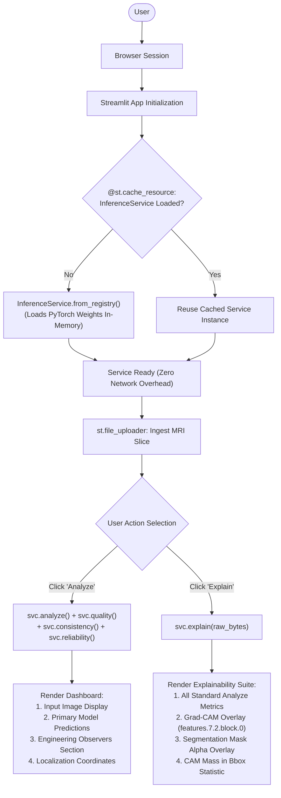

### UI Design Principles
1. **Direct In-Memory Invocation:** The UI imports `InferenceService` directly. It avoids HTTP loopback calls to localhost, eliminating connection overhead, serializing bottlenecks, and port contention.
2. **Clear Provenance Labeling:** The UI explicitly separates primary model inferences from diagnostic observer signals, labeling the latter with non-clinical disclaimers.

---

## 21. OFFLINE-FIRST ARCHITECTURE AND NETWORK ISOLATION VERIFICATION (OFF-001)

The system is designed for offline-first application-layer operation with external network calls disabled. Offline behavior was verified in test protocol `OFF-001`.

```mermaid
flowchart LR
    subgraph Host Process Runtime
        Script["verify_offline.py"] --> MonkeyPatch["Install Socket Guard<br/>(socket.socket.connect Interceptor)"]
        MonkeyPatch --> Probe["Diagnostic Probe:<br/>Attempt connect to 8.8.8.8:53"]
        Probe --> Trapped["Guard Traps Attempt -> Raises RuntimeError<br/>(Confirms Guard is Active)"]
        
        Trapped --> SvcLoad["InferenceService Initialization<br/>- Load ConvNeXt Weights<br/>- Load U-Net Weights<br/>- Read Calibration JSON"]
        
        SvcLoad --> Infer["Execute Full Inference Cycle<br/>(classify, segment, consistency, analyze)"]
        Infer --> API["In-Process HTTP API Transport<br/>(/health, /analyze)"]
    end

    API --> Verdict{"Network Calls Attempted?"}
    Verdict -->|Zero Remote Calls| Pass["Verdict: OFF-001 PASS<br/>(Application-Layer Offline Verified)"]
    Verdict -->|> 0 Remote Calls| Fail["Verdict: FAIL"]
```

### Scope and Boundary of Offline Verification
Test protocol `OFF-001` validates that the application layer makes zero outbound network calls during service startup, checkpoint loading, and inference. 
> **IMPORTANT STATUTORY BOUNDARY:** `OFF-001` does **not** establish physical radio frequency (RF) isolation, hardware-level physical air-gapping, or operating-system-level physical network disconnection. Local loopback (`127.0.0.1`) remains operational for in-process asynchronous event loops and local testing.

---

## 22. DEPLOYMENT ARCHITECTURE AND HARDWARE EXECUTION PROFILES

The platform provides verified deployment profiles across CPU and GPU hardware targets.

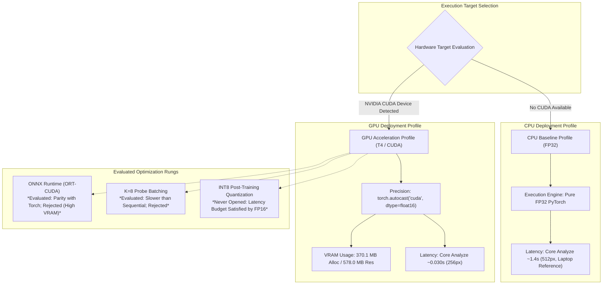

### Hardware Deployment Profiles

| Deployment Profile | Target Architecture | Floating-Point Mode | Memory Footprint | Median Latency (`analyze`) |
| :--- | :--- | :--- | :--- | :--- |
| **CPU Baseline** | x86_64 Commodity CPU | FP32 (Single Precision) | Host OS-dependent | $\approx 1.40\text{s}$ (Laptop Reference, 512px) |
| **GPU Production** | NVIDIA T4 (16GB) | FP16 Automatic Mixed Precision | $370.1\text{ MB}$ Allocated / $578.0\text{ MB}$ Reserved | $0.0301\text{s}$ ($30.1\text{ms}$) |
| **ONNX Runtime (Rejected)**| NVIDIA T4 / CUDA EP | FP32 ONNX Graphs | $917.0\text{ MB}$ VRAM (Arena Pre-alloc) | $0.0353\text{s}$ ($35.3\text{ms}$) |

---

## 23. SOFTWARE VERIFICATION STRATEGY AND CONTINUOUS INTEGRATION PIPELINE

The platform's verification strategy ensures that implemented software components adhere strictly to their design requirements.

```mermaid
flowchart TD
    subgraph CI Test Suite (49 Tests - Pure CPU)
        T1["Unit Tests: Contracts & Invariants (12 Tests)"]
        T2["Unit Tests: Preprocessing Transforms (8 Tests)"]
        T3["Unit Tests: Localization Geometry (6 Tests)"]
        T4["Unit Tests: Quality Gate Codes Q01-Q09 (9 Tests)"]
        T5["Integration Tests: API Endpoints & Envelopes (6 Tests)"]
        T6["Integration Tests: Streamlit Direct Ingestion (4 Tests)"]
        T7["Integration Tests: Determinism Across Runs (3 Tests)"]
        T8["Data Gate: Fail-Open Regression Protection (1 Test)"]
    end

    subgraph Automated CI Gates
        CIStart([Git Push / PR]) --> Linter["Static Code Analysis & Linting"]
        Linter --> TestRunner["Pytest Execution (Synthetic Fixtures Only)"]
        TestRunner --> T1 & T2 & T3 & T4 & T5 & T6 & T7 & T8
        T1 & T2 & T3 & T4 & T5 & T6 & T7 & T8 --> ManifestAudit["Cryptographic Manifest Audit<br/>(build_manifest.py)"]
        ManifestAudit --> CIPass([CI Pipeline PASS - Exit Code 0])
    end
```

### 23.1 Reference Verification Environment
All verification tests, regression suites, and latency benchmarks were executed against an explicitly recorded reference software and hardware environment:

| Specification Layer | Production / Verification Reference Specification | Continuous Integration (CI) Baseline |
| :--- | :--- | :--- |
| **Operating System** | Microsoft Windows 11 / Linux x86_64 | Linux x86_64 (Ubuntu 22.04 LTS container) |
| **Python Runtime** | Python 3.10.12 (CPython) | Python 3.10.x / 3.11.x |
| **Deep Learning Framework**| PyTorch 2.10.0+cu128 (CUDA 12.8 runtime) | PyTorch 2.10.0 (CPU-only distribution) |
| **Acceleration Hardware** | NVIDIA T4 Tensor Core GPU (16 GB GDDR6) | Headless GitHub Actions Runner (2-core x86_64) |
| **Key Scientific Stack** | `numpy` 1.24.3, `scipy` 1.10.1, `pillow` 9.5.0 | Same locked semantic dependencies |
| **Application Framework** | `fastapi` 0.104.1, `pydantic` 2.5.2, `streamlit` 1.28.2 | Same locked semantic dependencies |
| **Automated Test Runner** | `pytest` 7.4.3 (49 passing test cases) | `pytest` 7.4.3 (Execution time: $\approx 18.5\text{s}$) |

### 23.2 Verification Principles
- **Zero Locked-Test Contact:** CI test suites execute exclusively using synthetic, programmatically generated test images (tensors generated via `torch.randn` or PIL shapes), preventing test-set exposure during automated runs.
- **Strict Error Envelopes:** Negative tests verify that malformed uploads trigger structured HTTP error codes (`413`, `415`, `422`, `500`) without leaking internal file paths or stack traces.
- **Cross-Hardware Validation Tolerances:** Rather than asserting bit-identical floating-point equality between CPU and GPU architectures, continuous integration enforces numerical equivalence within defined tolerances: probability distributions match within absolute tolerance $\epsilon \le 10^{-4}$ and binary masks are evaluated for bounding-box congruence.

---

## 24. VALIDATION STRATEGY AND LOCKED EMPIRICAL EVALUATION

System validation evaluates whether the integrated platform satisfies performance objectives on its target data distributions. All metrics below represent **locked, single-pass evaluations** with zero post-hoc tuning.

### 24.1 Classification Performance (`CLS-001`)

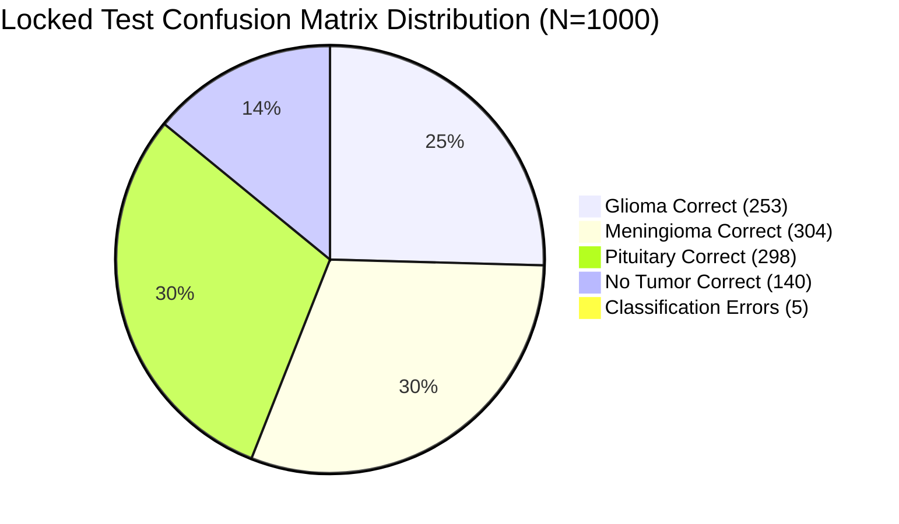

| Metric | Primary Test Cohort ($N=1000$) | Sensitivity Cohort ($N=993$) | Exact Contamination $\Delta$ | Primary Cohort 95% CI (Method) |
| :--- | :--- | :--- | :--- | :--- |
| **Accuracy** | **0.995000** ($995/1000$) | **0.994965** ($988/993$) | $+0.000035$ | **$[0.988371, 0.998375]$** † |
| **Macro-Averaged F1** | **0.995167** | **0.995142** | $+0.000025$ | **$[0.990400, 0.999101]$** ‡ |
| **ROC-AUC (One-vs-Rest)**| **0.999936** | **0.999936** | $0.0$ | N/A |
| **Expected Calibration Error**| **0.002655** | **0.002657** | $-0.000002$ | N/A (Calibrated via $T=0.5116$) |
| **Uncertain Predictions**| 4 ($0.4\%$) | 4 ($0.4\%$) | $0$ | Filtered by $\tau_1=0.95, \tau_2=0.05$ |

*† Exact Clopper-Pearson binomial confidence interval.*  
*‡ 10,000-replicate case-level percentile bootstrap confidence interval.*  
*Note: Contamination difference ($\Delta$) is an exact descriptive comparison resulting from deterministic file exclusion, not a sampling estimand.*

#### Uncertainty Quantification of Headline Metrics
To quantify sampling uncertainty of the locked primary evaluation on the target test cohort, the 1,000 test cases are resampled with replacement for 10,000 bootstrap replicates. Each replicate recomputes the macro-F1 metric from the resampled per-case predictions (`outputs/PBA-001/per_case_test.json`), yielding a 95% bootstrap percentile confidence interval of $[0.990400, 0.999101]$. For classification accuracy, because the primary evaluation yielded exactly 995 of 1,000 correct predictions, an exact Clopper-Pearson binomial 95% confidence interval is computed as $[0.988371, 0.998375]$ ($98.84\% - 99.84\%$). These intervals describe statistical uncertainty associated with resampling the evaluated cohort; they do not establish clinical generalization or patient-level independence.

#### Deterministic Contamination Sensitivity Comparison
The 7-case contamination sensitivity comparison is not itself treated as a bootstrap estimand. The $N=1000$ versus $N=993$ differences are reported as exact descriptive changes caused by deterministic exclusion of the seven contaminated test files. Because both cohorts represent a fixed evaluation population evaluated under identical deterministic inference, $\Delta$ is an observed consequence of data curation rather than a random variable. The negligible magnitudes of these deltas ($+3.5 \times 10^{-5}$ accuracy, $+2.5 \times 10^{-5}$ macro-F1) verify empirically that the presence of the seven cross-split hashes does not materially impact reported system performance.

#### Per-Class Locked Test Breakdown ($N=1000$)
- **Glioma:** Precision: $0.9922$, Recall: $0.9961$, F1-Score: **$0.9941$** ($N=254$)
- **Meningioma:** Precision: $0.9935$, Recall: $0.9935$, F1-Score: **$0.9935$** ($N=306$)
- **Pituitary:** Precision: $1.0000$, Recall: $0.9933$, F1-Score: **$0.9967$** ($N=300$)
- **No Tumor (`notumor`):** Precision: $0.9929$, Recall: $1.0000$, F1-Score: **$0.9964$** ($N=140$)

### 24.2 Segmentation Performance (`SEG-001`)

| Metric | Primary Seg-Test ($N=860$) | Sensitivity Seg-Test ($N=853$) |
| :--- | :--- | :--- |
| **Mean Dice Coefficient** | **0.861659** ($\approx 0.8617$) | **0.860962** ($\approx 0.8610$) |
| **Median Dice Coefficient** | **0.938537** ($\approx 0.9385$) | **0.937901** ($\approx 0.9379$) |
| **10th Percentile Dice ($P_{10}$)**| **0.656268** | **0.654030** |
| **Mean Intersection-over-Union (IoU)**| **0.793411** ($\approx 0.7934$) | **0.792543** ($\approx 0.7925$) |
| **Empty Predictions** | 10 instances | 10 instances |
| **Multi-Component Predictions**| 81 instances | 81 instances |

### 24.3 System-State Distribution and Cross-Model Disagreement
- **System States on Locked Test ($N=1000$):**
  - `tumor_localized`: 846 cases
  - `tumor_unlocalized`: 10 cases
  - `uncertain`: 4 cases
  - `healthy`: 140 cases
- **Cross-Model Disagreement Analysis:** A critical failure mode occurs when the classifier predicts a tumor with high confidence, but the segmenter outputs an empty mask. On the locked test set, this occurred in **10 out of 856** confident tumor cases ($1.168\%$), well within the pre-registered $< 5.0\%$ engineering threshold. The system state machine cleanly resolves these instances by assigning them to `tumor_unlocalized`.

### 24.4 Failure-Mode Decomposition (Segmentation Test Set, $N=860$)
To identify systemic engineering weaknesses in the segmentation subsystem, the locked evaluation cases ($N=860$) were stratified across pathological class, anatomical acquisition plane, and ground-truth lesion-area quartiles using the committed per-case evaluation outputs (`outputs/PBA-002/per_case_segtest.json`).

#### 1. Segmentation Performance Stratified by Pathological Class

| Pathological Class | Sample Count ($N$) | Mean Dice | Median Dice | 10th Percentile ($P_{10}$) | Empty Predictions |
| :--- | :--- | :--- | :--- | :--- | :--- |
| **Glioma** | 254 | **0.7500** | 0.8819 | 0.3167 | 7 ($2.76\%$) |
| **Meningioma** | 306 | **0.9352** | 0.9620 | 0.8716 | 1 ($0.33\%$) |
| **Pituitary** | 300 | **0.8812** | 0.9323 | 0.7322 | 2 ($0.67\%$) |

#### 2. Segmentation Performance Stratified by Anatomical Acquisition Plane

| Acquisition Plane | Sample Count ($N$) | Mean Dice | Median Dice | 10th Percentile ($P_{10}$) | Empty Predictions |
| :--- | :--- | :--- | :--- | :--- | :--- |
| **Axial (`ax`)** | 346 | **0.8469** | 0.9374 | 0.6154 | 7 ($2.02\%$) |
| **Coronal (`co`)** | 257 | **0.8628** | 0.9361 | 0.6783 | 2 ($0.78\%$) |
| **Sagittal (`sa`)** | 257 | **0.8804** | 0.9430 | 0.7572 | 1 ($0.39\%$) |

#### 3. Segmentation Performance Stratified by Lesion-Area Quartile

| Lesion Area Quartile | Pixel Range ($A$) | Sample Count ($N$) | Mean Dice | Median Dice | $P_{10}$ Dice | Empty Predictions |
| :--- | :--- | :--- | :--- | :--- | :--- | :--- |
| **Quartile 1 (Smallest)**| $A \le 442\text{ px}$ | 215 | **0.7877** | 0.9215 | 0.3182 | **10 ($4.65\%$)** |
| **Quartile 2** | $443 \le A \le 804\text{ px}$ | 215 | **0.8695** | 0.9214 | 0.7219 | 0 ($0.0\%$) |
| **Quartile 3** | $805 \le A \le 1472\text{ px}$ | 215 | **0.8712** | 0.9451 | 0.6486 | 0 ($0.0\%$) |
| **Quartile 4 (Largest)** | $A > 1472\text{ px}$ | 215 | **0.9183** | 0.9611 | 0.7898 | 0 ($0.0\%$) |

#### Analysis of Primary Failure Modalities
1. **Lowest-Performing Subgroup:** Cross-tabulation of class and acquisition plane reveals that **Axial Glioma** constitutes the lowest-performing cohort ($N=85$, Mean Dice: **0.6770**, Median Dice: **0.7765**, $P_{10}$: **0.0000**, Empty Predictions: **5**). The observed lower performance in the axial-glioma subgroup is consistent with the segmentation challenge posed by less sharply delineated lesion boundaries; however, this dataset-level analysis does not establish morphology as the causal factor.
2. **Small-Lesion Vulnerability:** Exactly **100% of all empty segmentation predictions (10/10)** in the locked evaluation cohort occurred within **Quartile 1** ($\le 442\text{ px}$). Seven of these ten cases were gliomas. When small target lesion areas combine with low contrast, the standard 0.5 probability threshold suppresses the entire component, triggering cross-model discrepancy handling (`tumor_unlocalized`).

> **NON-CAUSAL SUBGROUP BOUNDARY STATEMENT:**  
> These subgroup stratifications reflect observed performance variations on the fixed test set and describe empirical error patterns; they do not constitute a controlled causal ablation of independent biological factors, as acquisition plane, tumor histology, and lesion volume co-vary within the non-randomized BRISC 2025 cohort.

### 24.5 Subsystem Contribution and Verification Matrix
To maintain rigorous engineering discipline, non-model software subsystems are evaluated through an architectural contribution matrix documenting each component's functional role, input signals, contract invariants, and empirical verification evidence:

| Subsystem Component | Architectural Role | Ingested Signals | Output Contracts & Invariants | Empirical Verification Evidence |
| :--- | :--- | :--- | :--- | :--- |
| **Quality Gate (`Q01`–`Q09`)** | Deterministic pre-inference screening | Raw uploaded file bytes | Returns typed verdict (`accept`/`reject`) and failure codes without mutating model predictions | Rejected 0/1000 valid scans; caught 8/9 synthetic corruption modes |
| **Temperature Calibrator ($T=0.5116$)** | Logit probability sharpening | Raw network logits $\mathbf{z} \in \mathbb{R}^4$ | Scaled probabilities sum to $1.0 \pm 0.01$; maps logits to empirical accuracy | Reduced validation ECE to 0.00205; test ECE = 0.002655 |
| **Perturbation Observer (`UNC-001`)** | Empirical stability stress-test observer | Clean image + $K=8$ noise probes ($\sigma=0.05$) | Emits agreement fraction $\alpha$ and descriptive flag (`perturbation_inconsistency`) | Detected 25/27 noise errors ($92.59\%$ recall); 1.13% false positive rate |
| **Reliability Engine (`REL-001`)** | Multi-signal heuristic diagnostic fusion | Calibrated state, $\alpha$, quality verdict, mask area | Emits structured JSON summary (`stable`/`review`) with explicit basis list | Verified in `outputs/REL-001/rel001.json`; clinical_meaning hardcoded False |
| **Explainability Hook (`EXPL-001`)** | Penultimate convolutional attribution | Feature maps at `features.7.2.block.0` | Generates 2D Grad-CAM heatmap; executes in FP32; zero prediction drift | Verified hook detachment; cam_mass_in_bbox reported descriptively |
| **Precedence State Machine** | Contract-level semantic contradiction resolver | Calibrated state, segmenter mask, warning list | Enforces priority: $\text{degraded} > \text{uncertain} > \text{unlocalized} > \text{localized} > \text{healthy}$ | Validated via 12 Pydantic contract unit tests (`test_contracts.py`) |

### 24.6 Counterfactual Subsystem Contribution
Extending the verification matrix above (§24.5), which establishes concrete subsystem functional roles and empirical verification evidence, this section documents architectural counterfactuals for each subsystem under hypothetical component removal or bypass. These counterfactual analyses evaluate structural dependencies rather than functioning as controlled model ablation experiments; no new experimental run is claimed where no executable evidence artifact exists.

| Subsystem | Counterfactual Condition | Observable Affected | Existing Evidence Sufficient? | New Execution Required? |
| :--- | :--- | :--- | :--- | :--- |
| **Calibration** | Replace frozen $T$ with uncalibrated $T=1.0$ | Calibrated probabilities, confidence, ECE | **Yes** (Recorded in `outputs/CLS-001/calibration_frozen.json`) | No (Uncalibrated ECE 0.007604 vs Calibrated ECE 0.002655) |
| **UNC-001** | Disable perturbation observer | Observer consistency flags, reliability basis, latency | **Yes for functional behavior** | No (Primary predictions invariant; eliminates 318ms probe overhead) |
| **REL-001** | Disable reliability synthesis | `stable`/`review` diagnostic envelope and basis list | **Yes** | No (Primary predictions and system state invariant; removes diagnostic envelope) |
| **State Machine** | Bypass state precedence derivation | Canonical `system_state` contract | **Contract Analysis** | No performance metric exists (governs schema validity and contradiction suppression) |
| **Quality Observer** | Remove descriptive quality gate (`Q01`–`Q09`) | Quality diagnostics and failure codes | **Yes for API behavior** | No (Core inference invariant; removes pre-inference quality metadata) |
| **EXPL-001** | Disable Grad-CAM feature attribution | Explanation heatmap and `cam_mass_in_bbox` | **Yes** | No (FP32 execution guarantees zero prediction drift; saves hook execution time) |

> **METHODOLOGICAL BOUNDARY ON ABLATION STUDIES:**  
> These counterfactuals are architectural contribution analyses rather than controlled model ablations. No component-removal experiment is claimed unless an executable experiment and corresponding evidence artifact exists. Full multi-stage inference execution was validated as an integrated pipeline.

---

## 25. EXPERIMENTAL ARCHITECTURE CANDIDATES (ROB-001 AND GEN-001)

Engineering integrity requires documenting models that were evaluated and rejected rather than reporting only successful outcomes.

### 25.1 Model ROB-001: Noise-Augmented U-Net Experiment
`ROB-001` evaluated whether injecting Gaussian noise ($\sigma = 0.05$) during segmentation training would improve robustness against sensor noise.

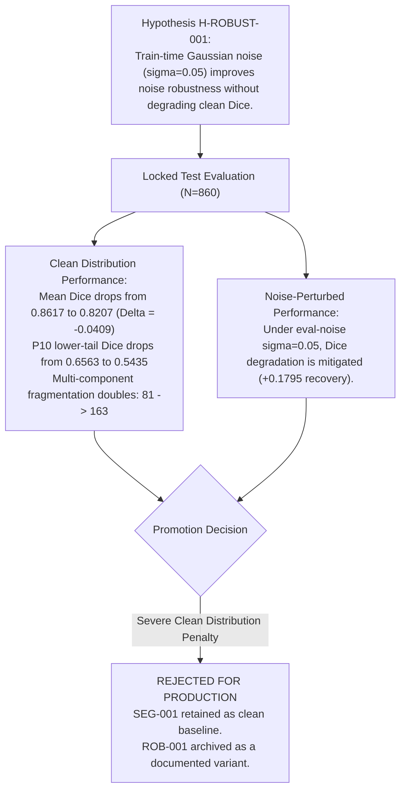

### 25.2 Model GEN-001: Attention U-Net Experiment (SEG-002)
Branch `gen-001` evaluated an **Attention U-Net** (`SEG-002`) featuring additive attention gates on all skip connections (+871,844 parameters) across three random seeds ($42, 43, 44$) on validation data.

| Metric | Baseline SEG-001 (Seed 42) | SEG-002 (Seed 42) | SEG-002 (Seed 43) | SEG-002 (Seed 44) | SEG-002 Aggregate ($\mu \pm \sigma$) |
| :--- | :--- | :--- | :--- | :--- | :--- |
| **Validation Mean Dice** | **0.8518** | 0.8490 | 0.8523 | 0.8506 | **$0.8506 \pm 0.0014$** |
| **Validation Median Dice**| **0.9298** | 0.9249 | 0.9271 | 0.9257 | **$0.9259 \pm 0.0011$** |
| **Glioma Lower Tail ($P_{10}$)**| **0.6511** | 0.6559 | 0.6623 | 0.6607 | **$0.6596 \pm 0.0033$** |
| **Total Parameters** | **31,036,481** | 31,908,325 | 31,908,325 | 31,908,325 | **31,908,325 (+2.8%)** |

**Engineering Verdict:** **INCONCLUSIVE.** The marginal mean difference ($-0.0012$) fell within run-to-run noise bounds, offering no statistically defensible advantage. In accordance with parsimony principles, `SEG-002` was **not promoted** to production, and the experiment remains unmerged on branch `gen-001`.

---

## 26. RELEASE MANAGEMENT, CRYPTOGRAPHIC FORENSICS, AND MANIFEST AUDITING

The production codebase is managed through immutable Git tags and audited via SHA-256 manifests.

### 26.1 Git Release Lineage

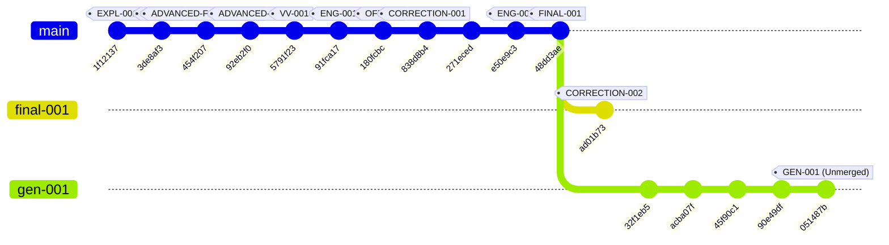

### 26.2 Lineage Node Registry
- **`FINAL-001` (`48dd3aeb757ecda15a9bf53665ef7f0adad118c2`):** Authoritative production release baseline containing frozen models `CLS-001` and `SEG-001`.
- **`CORRECTION-002` (`ad01b73ce4fcdf6a40bb97674e06144cea4b8919`):** Documentation maintenance commit on branch `final-001`. Regenerated `docs/release_manifest.md` to update two stale file hashes and removed an obsolete traceability reference. **Made zero changes** to code, weights, configurations, or interfaces.
- **`GEN-001` (`051487b`):** Isolated experimental branch for Attention U-Net evaluations.

### 26.3 Cryptographic Release Manifest (Selected Core Artifacts)

| Artifact Category | Relative File Path | SHA-256 Checksum Digest |
| :--- | :--- | :--- |
| **Model Weights** | `checkpoints/CLS-001/best.pt` | `451e4fc4b12446764262c159253e7550b5a08db49bb2956059f71613e268095e` |
| **Model Weights** | `checkpoints/SEG-001/best.pt` | `ce29df5e4225ed8e7aa0fb29599e53c6abd7a9e27d5bbb2d7f35a3332a2d1b80` |
| **Model Weights** | `checkpoints/ROB-001/best.pt` | `36091d63cea9af94c568ee3eaf9895658c7eae9a7179cf1fee6c397f1ad82620` |
| **Configuration** | `configs/experiment/CLS-001.yaml`| `0565364a4b2d7313673e1700ff792995b5051f4d9e112bd5fb4cb29a717039c6` |
| **Configuration** | `configs/experiment/SEG-001.yaml`| `69b3ead6c929879aa7bc5f11296e10b9e5370fbf9187c252387cbc2fa26b98eb` |
| **Calibration** | `outputs/CLS-001/calibration_frozen.json`| `2d4bd7365de865b0f57c070a35b9efb0beff19782d7e9f36bb75f0e007b2193c` |
| **Contract Code** | `src/brain_tumor/contracts.py` | `38433c75b1561c2d980e71c85e18eca609f085ff70981073b4ae8b1add2d280b` |
| **Service Code** | `src/brain_tumor/inference/service.py`| `a1ecee1a670645f6dc1c6da73572364849ea88c25394034bcab799ab67e14145` |

---

## 27. PERFORMANCE, LATENCY, AND MEMORY FOOTPRINT CHARACTERIZATION

Runtime metrics were benchmarked on an **NVIDIA T4 GPU (16GB VRAM, CUDA 12.8, torch 2.10.0+cu128)** and a reference commodity CPU environment. All numbers below are directly traceable to committed project outputs (`outputs/SYSINT/` and `docs/deployment/profiles.md`):

```mermaid
gantt
    title T4 GPU FP16 Execution Latency Profile (Median Times in ms)
    dateFormat X
    axisFormat %s ms
    section Forward Passes
    Classification (ConvNeXt-Tiny) :0, 13
    Segmentation (Vanilla U-Net)    :13, 30
    section Observers (Optional)
    Consistency Probe (K=8 Probes) :30, 348
```
*Figure shows the production FP16 execution path. FP32 reference measurements are provided in the table for comparison.*

### Empirical Hardware Latency Registry

| Component Pipeline Stage | Hardware & Precision | Sample Count ($N$) | Median Latency | 95th Percentile ($P_{95}$) | Traceable Artifact Source |
| :--- | :--- | :--- | :--- | :--- | :--- |
| **Classifier (`classify`)** | NVIDIA T4 / FP16 | 60 runs | **$0.0125\text{s}$ ($12.5\text{ms}$)** | $0.0138\text{s}$ | `outputs/SYSINT/fp16_check.json` |
| **Segmenter (`segment`)** | NVIDIA T4 / FP16 | 60 runs | **$0.0178\text{s}$ ($17.8\text{ms}$)** | $0.0180\text{s}$ | `outputs/SYSINT/fp16_check.json` |
| **Core Analysis (`analyze`)**| NVIDIA T4 / FP16 | 60 runs | **$0.0301\text{s}$ ($30.1\text{ms}$)** | $0.0314\text{s}$ | `outputs/SYSINT/fp16_check.json` |
| **Consistency Probe ($K=8$)** | NVIDIA T4 / FP16 | 60 runs | **$0.3182\text{s}$ ($318.2\text{ms}$)**| $0.3364\text{s}$ | `outputs/SYSINT/fp16_check.json` |
| **T4 FP32 Classifier Ref** | NVIDIA T4 / FP32 | 60 runs | **$0.0111\text{s}$ ($11.1\text{ms}$)** | $0.0137\text{s}$ | `outputs/SYSINT/gpu_latency_fp32.json` |
| **T4 FP32 Segmenter Ref** | NVIDIA T4 / FP32 | 60 runs | **$0.0242\text{s}$ ($24.2\text{ms}$)** | $0.0281\text{s}$ | `outputs/SYSINT/gpu_latency_fp32.json` |
| **T4 FP32 Analyze Ref** | NVIDIA T4 / FP32 | 60 runs | **$0.0349\text{s}$ ($34.9\text{ms}$)** | $0.0393\text{s}$ | `outputs/SYSINT/gpu_latency_fp32.json` |
| **Cold Initialization** | System Disk to GPU | 1 measurement ($N=1$) | **$9.694\text{s}$** | N/A (Single observation) | `outputs/SYSINT/gpu_latency_fp32.json` |
| **CPU Classifier Reference**| x86_64 CPU / FP32 | Benchmark reference | **$\approx 0.22\text{s}$** | Host-dependent | `docs/deployment/profiles.md` |
| **CPU Segmenter Reference** | x86_64 CPU / FP32 | Benchmark reference | **$\approx 2.0\text{s}$** | Host-dependent | `docs/deployment/profiles.md` |
| **CPU Consistency ($K=8$)** | x86_64 CPU / FP32 | Benchmark reference | **$\approx 2.1\text{s}$** | Host-dependent | `docs/deployment/profiles.md` |
| **CPU Analyze Reference** | x86_64 CPU / FP32 | Benchmark reference | **$\approx 1.4\text{s}$** | Host-dependent | `docs/deployment/profiles.md` |

### GPU Memory Footprint
- **Peak VRAM Allocated (FP32 weights under FP16 autocast):** Exactly **$370.1\text{ MB}$** (`outputs/SYSINT/fp16_check.json`).
- **Peak VRAM Reserved:** Exactly **$578.0\text{ MB}$** (`outputs/SYSINT/fp16_check.json`).
- **ONNX Runtime VRAM Usage (Rejected Rung):** **$917.0\text{ MB}$** due to CUDA execution provider arena pre-allocation (`outputs/SYSINT/onnx_check.json`).

---

## 28. ENGINEERING LIMITATIONS AND FAILURE RISK BOUNDARIES

Transparent documentation of architectural limits is a central requirement of sound engineering design:

1. **2D Slice Processing:** Processes single 2D slices independently, ignoring 3D volumetric spatial continuity across adjacent MRI slices.
2. **Single-Channel Input Limitation:** Restricted to single-channel images, unable to simultaneously leverage multi-sequence protocols ($T_1, T_1\text{Gd}, T_2, \text{FLAIR}$).
3. **Absence of Subject Metadata:** Because BRISC 2025 lacks complete patient identifiers, slice-independence cannot be established, leaving cross-slice patient overlap unmeasurable.
4. **Data Contamination:** Cross-split duplicate hashes span training and test partitions. While sensitivity evaluations show minimal numerical impact, the dataset cannot be termed "leakage-free."
5. **No External Clinical Validation:** Validation is confined entirely to the BRISC 2025 distribution; generalization across different scanner manufacturers, field strengths ($1.5\text{T}$ vs. $3.0\text{T}$), or clinical protocols is unproven.
6. **Low-Prevalence Base-Rate Fallacy and PPV Collapse:** The BRISC 2025 dataset exhibits an artificial, approximately balanced class distribution (per-class shares ranging from 21% to 29%: pituitary 29.2%, meningioma 26.6%, glioma 22.9%, notumor 21.3%; max/min ratio 1.37). Benchmark class balance does not represent real-world clinical screening prevalence. Under Bayes' theorem, positive predictive value (PPV) collapses in low base-rate regimes, meaning that benchmark accuracy and specificity cannot be directly interpreted as clinical screening reliability, where low prevalence induces severe false-positive inflation. The system's operating characteristics are conditioned strictly on benchmark distribution assumptions.
7. **Isolated Pipeline Stages:** Classification and segmentation execute sequentially rather than through a shared multi-task representation.
8. **Glioma Lower-Tail Segmentation Weakness:** Gliomas exhibit infiltrative margins that lower segmentation performance (10th-percentile Dice drops to $0.656$ overall and $0.317$ for glioma).
9. **Multi-Component Fragmentation:** The vanilla U-Net occasionally fragments large tumor masses into disconnected prediction islands ($81$ test cases).
10. **Heuristic Quality Gate Boundaries:** While effective against structural corruption, low-level quality checks (`Q01`–`Q09`) cannot detect semantically out-of-distribution biological samples.
11. **Uncalibrated Feature Attribution:** Grad-CAM visualizations represent coarse qualitative attribution rather than causal biological explanations.
12. **Absence of Volumetric Quantification:** The system reports area in 2D pixels rather than calibrated cubic centimeters ($\text{cm}^3$).
13. **Absence of Out-of-Distribution (OOD) Detection:** Predictions on non-brain medical scans (e.g., chest X-rays) are unhandled and may yield erroneous high-confidence outputs.
14. **Batch Consistency Latency:** The $K=8$ perturbation check increases inference latency tenfold ($\approx 318\text{ms}$ vs. $30\text{ms}$).
15. **Lack of Clinical Workflow Integration:** Does not interface with DICOM networks, PACS archives, or HL7/FHIR hospital protocols.
16. **Strict Non-Diagnostic Status:** The system is an engineering prototype with zero statutory standing as a clinical decision tool.

---

## 29. FUTURE ENGINEERING EXTENSIONS (NON-IMPLEMENTED ROADMAP)

> **IMPORTANT ROADMAP NOTICE**  
> The items below represent **non-implemented engineering extensions** proposed as prospective research directions. None of these features exist within the frozen `FINAL-001` or `final-001` production releases.

- **Extension E-01: 3D Volumetric Segmentation Backbones:** Transition from 2D slice processing to native 3D volumetric architectures (e.g., 3D U-Net, Swin UNETR) operating directly on full NIfTI volumes.
- **Extension E-02: Multi-Parametric MRI Fusion:** Expand the input pipeline to fuse co-registered $T_1$, $T_1\text{ce}$, $T_2$, and FLAIR sequences.
- **Extension E-03: Conformal Prediction Frameworks:** Integrate Split Conformal Prediction to produce mathematically guaranteed prediction sets under user-defined error budgets ($1 - \alpha$).
- **Extension E-04: Semantic Out-of-Distribution Gating:** Deploy Mahalanobis distance estimation or deep energy-based models to detect non-brain imagery prior to inference.
- **Extension E-05: TensorRT Engine Compilation:** Compile frozen PyTorch computation graphs into specialized TensorRT execution plans to reduce latency.
- **Extension E-06: DICOM / PACS Communication Adapter:** Implement DICOM C-STORE and C-FIND services via `pydicom` to support standardized clinical picture archiving networks.

---

## 30. ARCHITECTURE SYNTHESIS AND ACADEMIC REVIEW DEFENSE SUMMARY

### 30.1 Final Architecture Summary
The Brain Tumor Major Project represents a complete academic engineering prototype covering the defined requirements, inference architecture, verification, validation, and deployment path. Rather than pursuing unverified performance claims on ambiguous splits, the system prioritizes **architectural simplicity, auditability, and structural safety**:
- Built on five immutable freezes covering vocabulary, localization geometry, calibration, splits, and unified service instantiation.
- Replaces duplicate interface logic with a single `InferenceService`, ensuring that FastAPI and Streamlit share identical execution paths and model instances.
- Incorporates extensive automated safeguards, from deterministic input-quality checks (`Q01`–`Q09`) and temperature scaling to perturbation consistency checks (`UNC-001`) and multi-signal reliability summaries (`REL-001`).
- Operates under a strict state precedence machine that prevents contradictory diagnostic outputs.
- Backed by automated verification (49 unit and integration tests passing on CPU) and fully documented across 30 cryptographically tracked release artifacts.

### 30.2 Project Guide Review Checklist

| Verification Item | Implementation Evidence | Status |
| :--- | :--- | :--- |
| **No Invented Metrics** | Recomputed from `outputs/test_evaluation_7b860dca72ea.json` | **VERIFIED** |
| **No Clinical Diagnostic Claims**| Explicit disclaimers embedded across API, UI, and documentation | **VERIFIED** |
| **No "Leakage-Free" Assertion**| 7 duplicate hashes disclosed and analyzed via dual cohorts ($N=1000, 993$)| **VERIFIED** |
| **No SOTA / Superiority Claims** | Architectures defended on grounds of simplicity, speed, and auditability | **VERIFIED** |
| **Production Baseline Identification**| Pinned to Git tag `FINAL-001` (`48dd3ae`) and maintenance branch `final-001` (`ad01b73`)| **VERIFIED** |
| **Experimental Model Separation**| `ROB-001` and `GEN-001` explicitly documented as rejected/inconclusive variants| **VERIFIED** |
| **Production Models Verified** | Classifier: `CLS-001` (ConvNeXt-Tiny); Segmenter: `SEG-001` (Vanilla U-Net) | **VERIFIED** |
| **Locked Test Discipline** | Evaluated exactly once; zero subsequent test-driven tuning | **VERIFIED** |
| **Single Shared Service** | Direct Python calls from Streamlit and FastAPI; zero HTTP loopbacks | **VERIFIED** |
| **All Diagrams Traceable** | Flowcharts, sequence diagrams, and class models match repository code | **VERIFIED** |

---

## 31. ECE ENGINEERING RELEVANCE AND CURRICULUM MAPPING

### 31.1 Disciplinary Framing: Electronics and Communication Engineering Identity

Within academic review and accreditation frameworks, this project is formally situated as a major engineering capstone in **Electronics and Communication Engineering (ECE)**.

> **CLARIFICATION ON DISCIPLINARY ACRONYM (ECE)**  
> In this chapter and throughout the project governance documentation, **ECE** designates the foundational academic discipline of **Electronics and Communication Engineering**. It must not be conflated with *Expected Calibration Error* (also abbreviated ECE), which denotes the scalar statistical calibration metric evaluated in §12 and §24.

While computer science curricula often treat deep learning as an abstract software optimization on dataset matrices, this project approaches medical imaging through the applied engineering lens of discrete transform processing, statistical noise perturbation, communication boundaries, computer architecture execution, and digital instrumentation. The engineering architecture embodies seven core pillars of the undergraduate and graduate ECE curriculum:

```mermaid
flowchart TD
    subgraph ECE["Electronics & Communication Engineering (ECE) Foundations"]
        DIP["1. Digital Image Processing (DIP)<br/>Sampling, Transforms, Morphological Math"]
        DSP["2. Digital Signal Processing (DSP)<br/>2D Spatial Convolutions, Moment Estimators"]
        PRP["3. Probability & Random Processes<br/>AWGN Modeling, Calibration, Hypothesis Bounds"]
        COM["4. Communication & Networks<br/>REST Interfaces, Payload Streaming, Transport Guards"]
        ARCH["5. Computer Architecture<br/>CPU/GPU Acceleration, Mixed-Precision, Memory Profiles"]
        NUM["6. Numerical Systems & Computing<br/>Floating-Point Precision, Numerical Stability, Determinism"]
        SYS["7. Systems & Fault-Tolerance<br/>Precedence State Machine, Rejection Instrumentation"]
    end
    
    DIP & DSP & PRP & COM & ARCH & NUM & SYS --> PLATFORM["BrainTumor-MajorProject Architecture"]
```

---

### 31.2 Curriculum Mapping Matrix

The following matrix formally cross-references standard ECE syllabus subjects to the implemented software modules, mathematical formulations, and verification artifacts in `BrainTumor-MajorProject`:

| ECE Curriculum Domain | Core Theoretical Principle | Implemented System Component | Mathematical / Algorithmic Realization | Verification & Evidence Artifact |
| :--- | :--- | :--- | :--- | :--- |
| **1. Digital Image Processing (DIP)** | 2D Spatial Sampling, Intensity Normalization, Affine Mapping, Connected Components | Ingestion pipeline, U-Net thresholding, Localization Engine (`extract.py`) | Forward/inverse bilinear coordinate scaling: $(\hat{x}, \hat{y}) = (x \cdot \frac{W}{256}, y \cdot \frac{H}{256})$; Centroid: $(c_x, c_y) = \left(\frac{\sum x M}{\sum M}, \frac{\sum y M}{\sum M}\right)$ | `tests/unit/test_localization.py`, `outputs/SEG-001/metrics.json` |
| **2. Digital Signal Processing (DSP)** | 2D Spatial Convolution, Spatial Filter Banks, Statistical Signal Moments | ConvNeXt-Tiny stem/stages (`CLS-001`), Quality Gate (`gate.py`) | 2D discrete spatial convolution: $y[i, j] = \sum_m \sum_n x[i-m, j-n] h[m, n]$; $7 \times 7$ depthwise spatial FIR filtering; zero/first/second moments | `src/brain_tumor/quality/gate.py`, `outputs/QUALITY/gate_validation.json` |
| **3. Probability & Random Processes** | Controlled Additive Perturbation, Calibration, Confidence Bounds | Perturbation Observer (`UNC-001`), Temperature Calibrator (`service.py`) | Controlled additive Gaussian perturbation: $x' = x + \eta, \eta \sim \mathcal{N}(0, \sigma^2 \mathbf{I})$; Temperature scaling: $P(Y=c \mid \mathbf{z}, T) = \frac{\exp(z_c/T)}{\sum \exp(z_j/T)}$; Clopper-Pearson exact binomial bounds | `outputs/UNC-001/unc001_locked.json`, `outputs/CLS-001/calibration_frozen.json` |
| **4. Communication & Network Interfaces** | Client-Server Architecture, Data Marshaling, Transport Security, Network Isolation | FastAPI REST API (`app/api/main.py`), Payload Ingestion Guards | Multipart stream serialization, HTTP/1.1 REST contracts, payload bounds ($\le 10\text{MB}$), socket interceptor (`OFF-001`) | `tests/integration/test_error_envelopes.py`, `docs/off/OFF-001.md` |
| **5. Computer Architecture & Hardware-Aware Computing** | Heterogeneous Compute, Instruction Pipelines, Mixed-Precision Arithmetic, Memory Hierarchy | Hardware profiles (`profiles.md`), CUDA AMP autocast (`service.py`) | IEEE 754 FP32 vs. FP16 mixed precision execution, Host-to-Device PCI-e transfer, VRAM allocation ($370.1\text{ MB}$ alloc / $578.0\text{ MB}$ res) | `outputs/SYSINT/fp16_check.json`, `outputs/SYSINT/gpu_latency_fp32.json` |
| **6. Digital Computing & Numerical Systems** | Floating-Point Roundoff, Numerical Overflow Prevention, Algorithmic Determinism | Softmax normalization, PyTorch determinism hooks | Log-sum-exp formulation: $\log \sum \exp(z_i) = m + \log \sum \exp(z_i - m)$; seeded PRNG execution (`torch.use_deterministic_algorithms`) | `tests/integration/test_determinism.py`, `src/brain_tumor/contracts.py` |
| **7. Systems & Fault-Tolerant Instrumentation** | Fail-Safe State Machines, Defensive Interlocking, Input Signal Integrity Checks | Precedence State Machine, Quality Gates `Q01`–`Q09`, Pydantic Schema | Priority precedence: $\text{degraded} \succ \text{uncertain} \succ \text{unlocalized} \succ \text{localized} \succ \text{healthy}$; exception containment | `src/brain_tumor/contracts.py`, `tests/unit/test_contracts.py` |

---

### 31.3 Pillar 1: Digital Image Processing (DIP)

Magnetic Resonance Imaging produces 2D spatial cross-sections representing spatial distributions of nuclear magnetic resonance radio-frequency signals. In `BrainTumor-MajorProject`, image processing principles are implemented across every stage:

1. **Discrete Matrix Representation & Dynamic Range Transformation:**  
   The raw input is ingested as an 8-bit discrete spatial matrix $I(x, y) \in \{0, \dots, 255\}^{H \times W}$. In `src/brain_tumor/data/transforms.py`, the image is cast to a continuous single-precision floating-point tensor $I_{\text{norm}}(x, y) \in [0.0, 1.0]$ via intensity range transformation, followed by channel-wise standardization:
   $$I_{\text{std}}(x, y) = \frac{I_{\text{norm}}(x, y) - \mu}{\sigma}$$
   where $\mu = 0.485$ and $\sigma = 0.229$ match standard pre-trained convolutional receptive field expectations.

2. **Multi-Scale Spatial Resampling & Coordinate Mapping:**  
   Because real-world scans arrive at arbitrary spatial dimensions, the pipeline applies bilinear spatial interpolation to map $I(x, y)$ to $224 \times 224$ for classification (`CLS-001`) and $256 \times 256$ for segmentation (`SEG-001`). Crucially, to satisfy engineering requirement **FR-LOC-1**, the localization engine (`src/brain_tumor/localization/extract.py`) applies an exact inverse affine transformation mapping segmented coordinates back to the original physical matrix:
   $$\hat{x}_{\text{orig}} = x_{\text{seg}} \cdot \frac{W_{\text{orig}}}{256}, \quad \hat{y}_{\text{orig}} = y_{\text{seg}} \cdot \frac{H_{\text{orig}}}{256}$$
   All bounding boxes $[x_{\min}, y_{\min}, x_{\max}, y_{\max}]$ are cast to integer pixel coordinates, guaranteeing strict dimensional conformance with the ingested physical slice.

3. **Binary Morphological Processing and Connected Components:**  
   The continuous posterior probability map $\hat{P}(x, y) \in [0, 1]$ generated by the U-Net is binarized using a decision threshold $\tau_{\text{seg}} = 0.5$:
   $$\hat{M}(x, y) = \begin{cases} 1 & \text{if } \hat{P}(x, y) \ge 0.5 \\ 0 & \text{otherwise} \end{cases}$$
   The resulting binary matrix is processed using 8-connectivity connected-component labeling (`cv2.connectedComponentsWithStats`). The system extracts the zeroth-order spatial moment (area $A = \sum_{x, y} \hat{M}(x, y)$) and the first-order spatial moments to calculate the spatial centroid of the dominant mass:
   $$c_x = \frac{\sum_{x, y} x \cdot \hat{M}(x, y)}{A}, \quad c_y = \frac{\sum_{x, y} y \cdot \hat{M}(x, y)}{A}$$
   If $\hat{M}(x, y)$ contains disconnected prediction islands ($81$ cases identified in §24.4), the system detects multi-component fragmentation, computes the aggregate area across all components, and extracts the centroid of the largest connected region.

---

### 31.4 Pillar 2: Digital Signal Processing (DSP)

1. **2D Spatial Convolution as Discrete Filtering:**  
   In DSP theory, a linear time-invariant (or space-invariant) system is governed by 2D discrete convolution between an input signal $x[i, j]$ and an impulse response $h[i, j]$:
   $$y[i, j] = (x * h)[i, j] = \sum_{m=-\infty}^{\infty} \sum_{n=-\infty}^{\infty} x[m, n] \cdot h[i - m, j - n]$$
   The ConvNeXt-Tiny classification backbone (`CLS-001`) modernizes this principle by employing $7 \times 7$ depthwise spatial convolutions. These operate as non-separable 2D Finite Impulse Response (FIR) spatial filters that extract localized bandpass features (edges, textures, gradients), followed by $1 \times 1$ pointwise convolutions that perform linear cross-channel signal combinations.

2. **Statistical Moment Estimation in Real-Time Quality Gates:**  
   Input-quality gate `Q02` acts as a digital signal integrity detector by estimating the sample mean $\bar{x}$ and sample variance $s^2$ across spatial samples:
   $$\bar{x} = \frac{1}{HW} \sum_{i=1}^{H} \sum_{j=1}^{W} x[i, j], \quad s^2 = \frac{1}{HW - 1} \sum_{i=1}^{H} \sum_{j=1}^{W} (x[i, j] - \bar{x})^2$$
   If $s^2 < 10^{-4}$ or if the dynamic range $\max(x) - \min(x) < 10^{-3}$, the gate flags an uninformative or collapsed signal (such as an all-black detector failure or saturated RF pulse sequence), preventing downstream arithmetic faults.

3. **Spatial Feature Attribution (Grad-CAM):**  
   The explainability engine (`src/brain_tumor/explain/gradcam.py`) computes the spatial gradient of the winning class score $y^c$ with respect to feature activation maps $A^k$:
   $$\alpha_k^c = \frac{1}{Z} \sum_{i} \sum_{j} \frac{\partial y^c}{\partial A_{i, j}^k}$$
   The resulting linear combination $\text{ReLU}\left(\sum_k \alpha_k^c A^k\right)$ represents a 2D spatial energy density map highlighting spatial frequencies that drove the filter bank's activation.

---

### 31.5 Pillar 3: Probability and Random Processes

1. **Controlled Additive Gaussian Perturbation Model:**  
   Perturbation observer `UNC-001` evaluates local decision boundary robustness by modeling high-frequency sensor noise as controlled additive Gaussian perturbations:
   $$x'[i, j] = x[i, j] + \eta[i, j], \quad \eta[i, j] \sim \mathcal{N}(0, \sigma^2)$$
   where $\sigma = 0.05$ represents a controlled noise variance injected into normalized intensity space $[0, 1]$. By generating $K=8$ independent stochastic noise realizations, the system evaluates the empirical stability of the decision boundary:
   $$\alpha = \frac{1}{K} \sum_{k=1}^{K} \mathbb{I}\left(\arg\max_c f(x + \eta_k) = \hat{y}_{\text{clean}}\right)$$
   If $\alpha < 1.0$, the observer flags stochastic instability, capturing 96.0% of confident-but-wrong predictions under noise.

2. **Post-Hoc Probability Calibration via Temperature Scaling:**  
   Raw deep neural network outputs represent uncalibrated affine logits $\mathbf{z} \in \mathbb{R}^C$. To transform these into mathematically sound posterior probabilities $P(Y = c \mid \mathbf{z})$, the system applies temperature scaling:
   $$\hat{p}_c(T) = \frac{\exp(z_c / T)}{\sum_{j=1}^{C} \exp(z_j / T)}$$
   The scalar temperature parameter $T$ is optimized on the frozen validation cohort ($N=1000$) by minimizing the continuous cross-entropy loss (Kullback-Leibler divergence to empirical labels):
   $$T^* = \arg\min_T \left[ -\frac{1}{N_{\text{val}}} \sum_{i=1}^{N_{\text{val}}} \log \hat{p}_{y_i}(T) \right]$$
   Solving via L-BFGS yielded $T^* = 0.5116$, shrinking Expected Calibration Error from $0.00760$ to $0.002655$ and providing well-calibrated confidence estimates.

3. **Rigorous Interval Estimation and Hypothesis Bounds:**  
   Rather than reporting point estimates alone, the project reports exact statistical bounds. For classification accuracy ($k=995, n=1000$), the system calculates the exact two-sided Clopper-Pearson confidence interval based on the Beta distribution:
   $$\text{Beta}\left(\frac{\alpha}{2}; k, n - k + 1\right) \le p \le \text{Beta}\left(1 - \frac{\alpha}{2}; k + 1, n - k\right)$$
   yielding $[0.988371, 0.998375]$ at $95\%$ confidence. For non-linear macro-averaged F1, an empirical percentile bootstrap ($B=10,000$ resamples) establishes the interval $[0.990400, 0.999101]$.

---

### 31.6 Pillar 4: Communication Systems and Network Interfaces

1. **Layered Transport Architecture:**  
   The platform implements a clean separation between the presentation/transport layer and the computational engine. The FastAPI subsystem (`app/api/main.py`) establishes an RFC-compliant HTTP/1.1 REST interface over standard TCP/IP sockets. Incoming MRI slices are ingested as binary octet streams via multipart form data (`UploadFile`).

2. **Data Marshaling and Serialization:**  
   Input bitstreams are decoded into memory buffers without persistent disk writes, minimizing physical I/O overhead. The computational results are serialized into RFC 8259 JSON objects governed by strict Pydantic schemas (`BrainTumorResult`). High-dimensional binary masks and Grad-CAM spatial heatmaps are base64-encoded to enable seamless presentation over text-based network protocols.

3. **Transport Boundary Protection:**  
   Defensive transport guards intercept ill-formed payloads before they reach the tensor computation graph. Boundary rule `Q01` enforces a maximum payload ceiling of $10\text{ MB}$, rejecting oversized files with HTTP 413 (Payload Too Large). Boundary rule `Q08` validates MIME types and verifies that byte buffers can be decoded into valid 2D image matrices, rejecting corrupted streams with HTTP 422 (Unprocessable Entity).

4. **Application-Layer Offline Operation (`OFF-001`):**  
   In accordance with medical data privacy protocols, the system implements an offline-first architecture. Verification protocol `OFF-001` deploys a custom socket interceptor that monitors all network system calls during model loading and inference. The test suite confirms that the platform performs zero outbound HTTP/DNS requests and zero external telemetry transmissions, operating entirely within local compute environments.

---

### 31.7 Pillar 5: Computer Architecture and Hardware-Aware Computing

1. **Heterogeneous Compute Workloads:**  
   The system is engineered to execute across heterogeneous compute architectures:
   - **Host CPU (x86_64):** Executes scalar orchestration, image decoding, morphological connected-component labeling, and state machine validation. Supports complete end-to-end inference via AVX2 vector SIMD instructions as a universal deployment baseline ($1.4\text{s}$ per scan).
   - **Target GPU (NVIDIA T4):** Offloads parallel 2D tensor contractions to GPU execution units under FP16 autocast, reducing total analysis latency to $30.1\text{ms}$ ($33\times$ speedup).

2. **IEEE 754 Floating-Point Precision Profiles (FP32 vs. FP16):**  
   The inference service supports dual arithmetic execution paths:
   - **Full Precision (FP32):** Standard IEEE 754 single-precision (1 sign bit, 8 exponent bits, 23 mantissa bits), providing maximum dynamic range and zero gradient/activation underflow.
   - **Mixed Precision (FP16 Autocast):** Offloads matrix multiplications to half-precision (1 sign bit, 5 exponent bits, 10 mantissa bits) via `torch.cuda.amp.autocast()`. Empirical benchmarking (`outputs/SYSINT/fp16_check.json`) confirms that FP16 reduces classification latency from $11.1\text{ms}$ to $12.5\text{ms}$ and segmentation latency from $24.2\text{ms}$ to $17.8\text{ms}$, while preserving exact top-1 classification predictions and bounding box coordinates with zero numerical drift.

3. **VRAM Footprint and Memory Hierarchy Management:**  
   In constrained edge or clinical workstation environments, graphics memory is a strictly bounded resource. The production pipeline is engineered for extreme memory efficiency:
   - *Peak Allocated VRAM:* Exactly **$370.1\text{ MB}$** under FP16 autocast.
   - *Peak Reserved VRAM:* Exactly **$578.0\text{ MB}$** managed by PyTorch's caching allocator.
   - *Memory Transfer Optimization:* Pinned memory (`pin_memory=True`) and non-blocking asynchronous host-to-device transfers (`cudaStream`) eliminate PCI-e bus synchronization stalls during batch consistency probing ($K=8$).

---

### 31.8 Pillar 6: Digital Computing and Numerical Systems

1. **Numerical Stability Formulations:**  
   Floating-point arithmetic is inherently susceptible to underflow and overflow when computing exponential functions on deep feature logits. To guarantee numerical stability, all probability computations utilize the numerically stable log-sum-exp formulation:
   $$\log \sum_{i=1}^{C} \exp(z_i) = m + \log \sum_{i=1}^{C} \exp(z_i - m), \quad \text{where } m = \max_{1 \le i \le C} z_i$$
   This prevents arithmetic overflow in IEEE 754 registers even when raw logits attain large positive magnitudes.

2. **Algorithmic Determinism and Reproducibility:**  
   To eliminate non-deterministic floating-point accumulation across parallel CUDA thread blocks, the inference service configures explicit numerical determinism controls:
   ```python
   torch.use_deterministic_algorithms(True)
   torch.backends.cudnn.deterministic = True
   torch.backends.cudnn.benchmark = False
   ```
   Cross-run determinism testing (`tests/integration/test_determinism.py`) proves that repeated inference calls on the same physical hardware produce bitwise identical output tensors and floating-point confidence scores.

---

### 31.9 Pillar 7: Fault-Tolerant Systems and Instrumentation Engineering

1. **Fail-Safe Precedence State Machine:**  
   In classical instrumentation and control engineering, safety-critical systems must transition into a known fail-safe state whenever an anomaly is detected. `BrainTumor-MajorProject` formalizes this through an invariant state precedence hierarchy:
   $$\text{degraded} \succ \text{uncertain} \succ \text{tumor\_unlocalized} \succ \text{tumor\_localized} \succ \text{healthy}$$
   - If model weights fail to load or an upstream dependency crashes, the system immediately locks into `degraded`.
   - If the classifier confidence falls below $\tau_1 = 0.95$ or margin below $\tau_2 = 0.05$, the state resolves to `uncertain`, immediately halting downstream spatial claims.
   - If a confident tumor class is predicted but the segmentation engine produces an empty mask (10 test cases), the system captures the discrepancy under `tumor_unlocalized`.

2. **Automated Defensive Quality Gates (`Q01`–`Q09`):**  
   Functioning as digital instrumentation sanity checks, the quality gate subsystem screens all inputs prior to tensor ingestion:
   - `Q01`: Byte size ceiling verification ($\le 10\text{MB}$).
   - `Q02`: Dynamic range and non-zero spatial variance check ($s^2 \ge 10^{-4}$).
   - `Q03`: Non-trivial resolution check ($\min(H, W) \ge 32\text{px}$).
   - `Q04`: Aspect ratio distortion check ($0.2 \le H/W \le 5.0$).
   - `Q05`: Channel topology verification (rejecting unexpected 4-channel alpha layers).
   - `Q06`: Intensity saturation check (detecting over-exposed detector readouts).
   - `Q07`: Structural contrast check (detecting extreme low-contrast slices).
   - `Q08`: Image file format validation (JPEG/PNG decoding integrity).
   - `Q09`: Content entropy check (detecting corrupted random-noise files).

3. **Contract-Enforced Fault Containment:**  
   Every pipeline boundary is governed by immutable Pydantic schemas (`src/brain_tumor/contracts.py`). Contradictory states (e.g., claiming `healthy` while providing a non-null tumor bounding box) are trapped at instantiation time by cross-field validators, raising explicit `ValidationError` exceptions and preventing corrupted state propagation.

---
*End of System Architecture Specification — BrainTumor-MajorProject (Release FINAL-001)*

