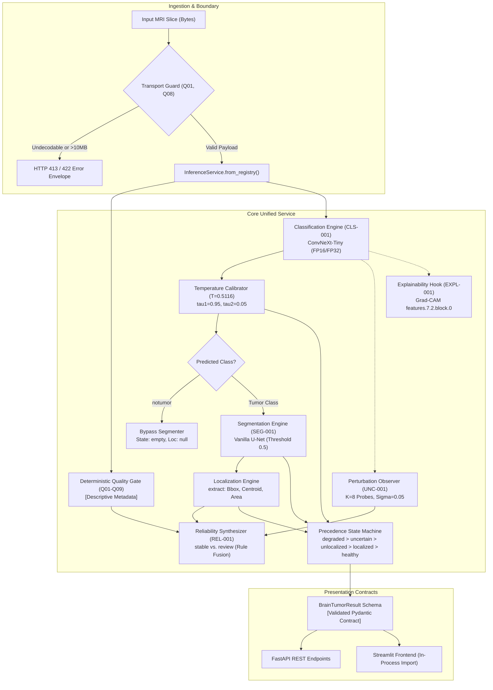

# ACADEMIC REVIEWER AND PROJECT GUIDE BRIEF
## Multi-Stage MRI Brain Tumor Classification, Segmentation, and Reliability Platform
### Authoritative Baseline: Release `FINAL-001` (`48dd3ae`) / Maintenance Branch: `final-001` (`ad01b73`)

---

**Document Purpose:** Executive Technical Brief and Examination Summary  
**Project Identifier:** `BrainTumor-MajorProject`  
**System Version:** Release Baseline `FINAL-001` (Commit `48dd3ae`) / Lineage `ad01b73` (`CORRECTION-002`)  
**Target Audience:** Major Project Guide, Technical Review Board, and External Examiners  
**Authoritative Reference:** Detailed 31-chapter [System Architecture Specification](architecture/system_architecture_specification.md) (`docs/architecture/system_architecture_specification.md`)  
**Publication Date:** September 2026  

---

### STATUTORY MANDATE & ENGINEERING BOUNDARIES

> **CORE GOVERNANCE NOTICE**  
> This software is an **applied computer-vision and software systems engineering major project**, not a clinical diagnostic medical device or Software-as-a-Medical-Device (SaMD).
>
> 1. **No Clinical Diagnostic Claims:** The system is neither certified nor intended for clinical diagnosis, patient triage, surgical planning, or therapy selection.
> 2. **Evaluation Distribution Strictly Bounded:** All empirical metrics reflect retrospective evaluation strictly on the static BRISC 2025 benchmark cohort (`arXiv:2506.14318`). Generalizability across external medical centers, scanner manufacturers, or clinical acquisition protocols is unproven.
> 3. **No Patient-Level Independence Claimed:** Because the upstream BRISC 2025 dataset does not provide complete subject/patient identifiers, slice independence cannot be clinically asserted.
> 4. **Honest Contamination Disclosure:** Cross-split duplicate image hashes (7 test images byte-identical to 9 training files) are explicitly tracked and disclosed. The system is evaluated on both primary ($N=1000$) and quarantined sensitivity ($N=993$) cohorts. The dataset is **not** claimed to be "leakage-free."
> 5. **No Superiority or SOTA Claims:** Architectures were selected based on parameter efficiency, execution speed, deterministic receptive fields, and auditability. No claim of state-of-the-art superiority over alternative models is made.

---

## 1. SYSTEM ARCHITECTURE & CORE TOPOLOGY

The platform implements an integrated, modular pipe-and-filter pipeline that ingests 2D axial, coronal, or sagittal brain MRI slices and produces 4-class pathological classification, calibrated confidence scoring, pixel-level binary tumor segmentation, deterministic coordinate localization, input-quality auditing, perturbation-stability assessment, and an invariant-enforced system state.

### Core Architectural Invariants
1. **Single Shared Service Architecture:** Complete elimination of dual codebases. A single core class, `InferenceService`, is imported directly in-process by both FastAPI and Streamlit. Streamlit executes with zero HTTP loopback overhead.
2. **Deterministic State Precedence:** Contradictory states are eliminated via contract-level priority:
   $$\text{degraded} \succ \text{uncertain} \succ \text{tumor\_unlocalized} \succ \text{tumor\_localized} \succ \text{healthy}$$
3. **Decoupled Observers:** Input-quality checks (`Q01`–`Q09`), perturbation consistency (`UNC-001`), reliability synthesis (`REL-001`), and Grad-CAM explanations (`EXPL-001`) function as non-intrusive observers. They report rich diagnostic metadata without mutating primary predictions.
4. **Offline-First Application Layer:** The system operates with external network calls disabled (`OFF-001`), verifying zero remote socket connections during startup, checkpoint loading, and inference.

---

## 2. REQUIREMENTS TRACEABILITY MATRIX (CONDENSED)

| Requirement | Description | Implementation Component | Primary Verification Artifact |
| :--- | :--- | :--- | :--- |
| **FR-CLS-1** | 4-Class Pathology Vocabulary | `service.py::classify` | `outputs/test_evaluation_7b860dca72ea.json` |
| **FR-CLS-2** | Calibrated Confidence Logic | `service.py`, `calibration_frozen.json` | Frozen $T=0.5116, \tau_1=0.95, \tau_2=0.05$ |
| **FR-SEG-1** | Binary Tumor Delineation | `src/brain_tumor/segmentation/unet.py` | `outputs/SEG-001/metrics.json` |
| **FR-LOC-1** | Integer Bbox & Float Centroid | `src/brain_tumor/localization/extract.py`| `tests/unit/test_localization.py` |
| **FR-CON-1** | Perturbation Observer ($K=8$) | `service.py::consistency` | `outputs/UNC-001/unc001_locked.json` |
| **FR-REL-1** | Multi-Signal Diagnostic Fusion | `src/brain_tumor/reliability/engine.py` | `outputs/REL-001/rel001.json` |
| **FR-QLT-1** | Quality Gate Observer (`Q01`–`Q09`)| `src/brain_tumor/quality/gate.py` | `outputs/QUALITY/gate_validation.json` |
| **FR-QLT-2** | Transport Boundary Rejection | `app/api/main.py` | `tests/integration/test_error_envelopes.py` |
| **FR-EXP-1** | Deterministic Grad-CAM Overlay | `src/brain_tumor/explain/gradcam.py` | `outputs/EXPL-001/expl001.json` |
| **FR-SYS-1** | Invariant State Precedence | `src/brain_tumor/contracts.py` | `tests/unit/test_contracts.py` |
| **NFR-REPRO-1**| Cryptographic Manifest Audit | `scripts/release/build_manifest.py` | `docs/release_manifest.md` (30 tracked files) |
| **NFR-DET-1**| Same-Environment Determinism | Pipeline Execution Engines | `tests/integration/test_system.py` |
| **NFR-CPU-1**| Universal CPU Baseline | Pure PyTorch FP32 Subsystem | 49 passed CI unit/integration tests |
| **NFR-GPU-1**| FP16 Mixed Precision Parity | `service.py::_autocast()` | `outputs/SYSINT/fp16_check.json` |
| **NFR-OFF-1**| Offline-First Integrity | Application Socket Interceptor | `docs/off/OFF-001.md` |

---

## 3. DATA GOVERNANCE & CONTAMINATION FORENSICS

- **Source Corpus:** BRISC 2025 release (`arXiv:2506.14318`), consisting of 6,000 single-channel 2D MRI slices formatted as JPEGs.
- **Official Split Partitions:** 5,000 images in the training pool; 1,000 images in the locked test set.
- **Production Partition Allocations:**
  - *Project Training Split:* Exactly 4,000 images (hash-quarantined).
  - *Project Validation Split:* Exactly 1,000 images (used exclusively for early stopping and calibration).
  - *Locked Test Split:* Exactly 1,000 images (evaluated exactly once after all parameters were permanently frozen).
- **Contamination Forensics:** SHA-256 deduplication identified seven (7) test images with byte-identical hashes in the training pool (spanning 9 training files).
  - *Mitigation Protocol:* The 9 training duplicates were assigned to the project training partition during hash-quarantined re-partitioning, keeping the project validation partition free of test-identical identities.
  - *Dual Reporting:* Performance is reported across both the primary locked test cohort ($N=1000$) and the quarantined sensitivity population ($N=993$).
- **Class Distribution:** The BRISC 2025 dataset exhibits an approximately balanced class distribution, with per-class shares ranging from 21% to 29% (pituitary: 29.2%, meningioma: 26.6%, glioma: 22.9%, notumor: 21.3%; max/min ratio 1.37).

---

## 4. EMPIRICAL VALIDATION & BENCHMARK PERFORMANCE

All metrics represent **locked, single-pass evaluations** with zero post-hoc tuning.

### 4.1 Classification Performance (`CLS-001`: ConvNeXt-Tiny)

| Evaluation Metric | Primary Test Cohort ($N=1000$) | Quarantined Sensitivity ($N=993$) | Exact Contamination Delta ($\Delta$) | Statistical 95% Confidence Interval (Primary) |
| :--- | :--- | :--- | :--- | :--- |
| **Accuracy** | **0.995000** ($995/1000$) | **0.994965** ($988/993$) | $+0.000035$ | **$[0.988371, 0.998375]$** — Exact Clopper-Pearson |
| **Macro-Averaged F1** | **0.995167** | **0.995142** | $+0.000025$ | **$[0.990400, 0.999101]$** — 10k Percentile Bootstrap |
| **ROC-AUC (OvR)** | **0.999936** | **0.999936** | $0.0$ | N/A |
| **Expected Calibration Error**| **0.002655** | **0.002657** | $-0.000002$ | Calibrated via $T=0.5116$ (Uncalibrated: 0.0076) |
| **Uncertain Predictions** | 4 ($0.4\%$) | 4 ($0.4\%$) | $0$ | Filtered by $\tau_1=0.95, \tau_2=0.05$ |

- **Headline Uncertainty Interpretation:** The 95% Clopper-Pearson binomial interval on accuracy ($98.84\% - 99.84\%$) and 10,000-replicate bootstrap percentile interval on macro-F1 ($0.9904 - 0.9991$) quantify statistical uncertainty associated with resampling the evaluated cohort.
- **Deterministic Sensitivity Comparison:** The 7-case contamination sensitivity delta ($+3.5 \times 10^{-5}$ accuracy, $+2.5 \times 10^{-5}$ macro-F1) is an exact descriptive difference resulting from deterministic exclusion of the seven duplicate files; it is not treated as a random variable. The negligible magnitude confirms that cross-split duplicates do not inflate generalization.

### 4.2 Segmentation Performance (`SEG-001`: Vanilla U-Net)

| Evaluation Metric | Primary Seg-Test ($N=860$) | Sensitivity Seg-Test ($N=853$) | Engineering Note |
| :--- | :--- | :--- | :--- |
| **Mean Dice Coefficient** | **0.861659** ($\approx 0.8617$) | **0.860962** ($\approx 0.8610$) | Primary continuous overlap metric |
| **Median Dice Coefficient** | **0.938537** ($\approx 0.9385$) | **0.937901** ($\approx 0.9379$) | Robust central tendency |
| **10th Percentile Dice ($P_{10}$)**| **0.656268** | **0.654030** | Measures lower-tail boundary difficulty |
| **Mean Intersection-over-Union**| **0.793411** ($\approx 0.7934$) | **0.792543** ($\approx 0.7925$) | Strict spatial overlap |
| **Empty Predictions** | 10 instances ($1.16\%$) | 10 instances ($1.17\%$) | Trapped by `tumor_unlocalized` state |
| **Multi-Component Predictions** | 81 instances | 81 instances | Geometric fragmentation instances |

### 4.3 System State Distribution & Discrepancy Containment
On the locked primary test set ($N=1000$):
- `tumor_localized`: **846** cases ($84.6\%$) — Validated spatial agreement.
- `tumor_unlocalized`: **10** cases ($1.0\%$) — Cross-model discrepancy containment.
- `uncertain`: **4** cases ($0.4\%$) — Sub-threshold confidence or margin.
- `healthy`: **140** cases ($14.0\%$) — Verified non-tumor baseline invariant.
- *Cross-Model Discrepancy Rate:* Occurred in 10 of 856 confident tumor cases ($1.168\%$), safely within the pre-registered $< 5.0\%$ engineering threshold.

---

## 5. FAILURE-MODE DECOMPOSITION (§24.4)

Analysis of all 860 segmentation test records (`outputs/PBA-002/per_case_segtest.json`) uncovers explicit empirical failure modalities:

### 1. Stratification by Pathological Class
- **Meningioma** ($N=306$): Mean Dice **0.9352**, Median **0.9620**, $P_{10}$ **0.8716**, Empty **1** ($0.33\%$)
- **Pituitary** ($N=300$): Mean Dice **0.8812**, Median **0.9323**, $P_{10}$ **0.7322**, Empty **2** ($0.67\%$)
- **Glioma** ($N=254$): Mean Dice **0.7500**, Median **0.8819**, $P_{10}$ **0.3167**, Empty **7** ($2.76\%$)

### 2. Stratification by Acquisition Plane
- **Sagittal** ($N=257$): Mean Dice **0.8804**, Median **0.9430**, $P_{10}$ **0.7572**, Empty **1** ($0.39\%$)
- **Coronal** ($N=257$): Mean Dice **0.8628**, Median **0.9361**, $P_{10}$ **0.6783**, Empty **2** ($0.78\%$)
- **Axial** ($N=346$): Mean Dice **0.8469**, Median **0.9374**, $P_{10}$ **0.6154**, Empty **7** ($2.02\%$)

### 3. Stratification by Lesion-Area Quartile
- **Quartile 1 ($\le 442\text{ px}$)**: Mean Dice **0.7877**, Median **0.9215**, $P_{10}$ **0.3182**, Empty **10 ($100\%$ of all empty predictions)**
- **Quartile 2 ($443 - 804\text{ px}$)**: Mean Dice **0.8695**, Median **0.9214**, $P_{10}$ **0.7219**, Empty **0** ($0.0\%$)
- **Quartile 3 ($805 - 1472\text{ px}$)**: Mean Dice **0.8712**, Median **0.9451**, $P_{10}$ **0.6486**, Empty **0** ($0.0\%$)
- **Quartile 4 ($> 1472\text{ px}$)**: Mean Dice **0.9183**, Median **0.9611**, $P_{10}$ **0.7898**, Empty **0** ($0.0\%$)

### Primary Engineering Insights
- **Lowest Subgroup Cell:** **Axial Glioma** constitutes the lowest-performing cohort ($N=85$, Mean Dice: **0.6770**, Median: **0.7765**, $P_{10}$: **0.0000**, Empty: **5**). The observed lower performance in this subgroup is consistent with the segmentation challenge posed by less sharply delineated lesion boundaries; however, this dataset-level analysis does not establish morphology as the causal factor.
- **Small-Lesion Vulnerability:** Exactly 100% of all empty segmentation predictions (10/10) occurred in Quartile 1 ($\le 442\text{ px}$), with 7/10 occurring in gliomas.

---

## 6. RELIABILITY OBSERVERS & COUNTERFACTUAL ANALYSIS

### 6.1 Perturbation Observer Contingency Matrix (`UNC-001`)
Evaluated under eval-noise stress testing ($\sigma=0.05$ additive Gaussian noise in $[0, 1]$ intensity domain):

| Observer Status | Perturbation Error (True Error) | Invariant (No Error) | Total Cohort |
| :--- | :--- | :--- | :--- |
| **Flagged ($\alpha < 1.0$)** | **$25$ (True Positive, TP)** | **$11$ (False Positive, FP)** | **$36$** (Flag Rate: $3.60\%$) |
| **Unflagged ($\alpha = 1.0$)** | **$2$ (False Negative, FN)** | **$962$ (True Negative, TN)** | **$964$** |
| **Total Evaluated** | **$27$** | **$973$** | **$1000$** |

- **Detector Performance:** Precision $= 69.44\%$, Recall $= 92.59\%$, F1 $= 79.49\%$, False Positive Rate $= 1.13\%$.
- **Confident-But-Wrong (CBW) Capture:** Flags **24 of 25** ($96.0\%$) confident prediction errors under noise, compared to standard softmax thresholding which captures only 5 of 27 ($18.52\%$).

### 6.2 Counterfactual Subsystem Contribution (§24.6)
Rather than manufacturing artificial model ablations without dedicated retraining experiments, the project evaluates non-model subsystems via architectural counterfactual analysis:

| Subsystem Component | Counterfactual Condition | Observable Affected | Existing Evidence | New Run Required? |
| :--- | :--- | :--- | :--- | :--- |
| **Temperature Calibration** | Replace frozen $T$ with uncalibrated $T=1.0$ | Softmax probabilities, confidence, ECE | Validation ECE $0.00205$ vs $0.00760$ uncalibrated | No (Derivation in `calibration_frozen.json`) |
| **UNC-001 Consistency** | Disable $K=8$ perturbation probes | Observer flags, reliability basis list, latency | Eliminates $318\text{ms}$ probe overhead; predictions invariant | No (Descriptive observer only) |
| **REL-001 Synthesis** | Bypass rule-based reliability engine | Emitted `stable`/`review` diagnostic envelope | Removes multi-signal diagnostic metadata | No (Contract schema invariant) |
| **Precedence State Machine**| Bypass priority state resolver | Canonical `system_state` output contract | Prevents contradiction suppression; raises schema errors | No (Contract unit tests verify invariant) |
| **Quality Gate (`Q01`–`Q09`)**| Remove descriptive input screening | Quality failure codes attached to payload | Removes pre-inference heuristic verification | No (Core inference unaffected) |
| **EXPL-001 Grad-CAM** | Disable feature attribution hooks | Grad-CAM heatmap and `cam_mass_in_bbox` | Saves hook execution time; FP32 preserves exact logits | No (Zero numerical drift verified) |

---

## 7. HARDWARE PERFORMANCE & RUNTIME PROFILES

Benchmarked on an **NVIDIA T4 GPU (16GB VRAM, CUDA 12.8)** and reference commodity x86_64 CPU:

| Component Stage | Hardware Target & Mode | Sample Count | Median Latency | Memory Footprint | Traceable Evidence |
| :--- | :--- | :--- | :--- | :--- | :--- |
| **Classifier (`classify`)** | NVIDIA T4 / FP16 Autocast | 60 runs | **$0.0125\text{s}$ ($12.5\text{ms}$)** | Part of allocated pool | `outputs/SYSINT/fp16_check.json` |
| **Segmenter (`segment`)** | NVIDIA T4 / FP16 Autocast | 60 runs | **$0.0178\text{s}$ ($17.8\text{ms}$)** | Part of allocated pool | `outputs/SYSINT/fp16_check.json` |
| **Core Analysis (`analyze`)** | NVIDIA T4 / FP16 Autocast | 60 runs | **$0.0301\text{s}$ ($30.1\text{ms}$)** | $370.1\text{ MB}$ Alloc / $578.0\text{ MB}$ Res | `outputs/SYSINT/fp16_check.json` |
| **Consistency Probes ($K=8$)** | NVIDIA T4 / FP16 Autocast | 60 runs | **$0.3182\text{s}$ ($318.2\text{ms}$)** | Constant VRAM footprint | `outputs/SYSINT/fp16_check.json` |
| **T4 Reference Core (`analyze`)**| NVIDIA T4 / Pure FP32 | 60 runs | **$0.0349\text{s}$ ($34.9\text{ms}$)** | $370.1\text{ MB}$ Allocated | `outputs/SYSINT/gpu_latency_fp32.json` |
| **Cold Initialization** | Cold Load (Disk to GPU) | Single ($N=1$) | **$9.694\text{s}$** | Peak initialization allocation | `outputs/SYSINT/gpu_latency_fp32.json` |
| **CPU Reference Core (`analyze`)**| x86_64 CPU / Pure FP32 | Benchmark ref | **$\approx 1.40\text{s}$** (512px) | Host OS-dependent | `docs/deployment/profiles.md` |

---

## 8. EXPERIMENTAL ARCHITECTURE DECISION RECORD

1. **ROB-001 (Train-Time Gaussian Noise Augmentation) $\rightarrow$ REJECTED:**
   - Evaluated whether train-time Gaussian noise ($\sigma=0.05$) improves segmentation robustness.
   - *Outcome:* Caused unacceptable clean-distribution performance degradation: clean mean Dice dropped from $0.8617$ to $0.8207$ ($\Delta = -0.0409$), lower-tail $P_{10}$ dropped to $0.5435$, and multi-component fragmentation doubled ($81 \to 163$). Rejected in favor of retaining clean baseline `SEG-001`.
2. **GEN-001 (Attention U-Net / SEG-002) $\rightarrow$ INCONCLUSIVE & UNMERGED:**
   - Evaluated additive attention gates on U-Net skip connections (+871,844 parameters) across 3 random seeds ($42, 43, 44$).
   - *Outcome:* Validation mean Dice was $0.8506 \pm 0.0014$ vs. baseline $0.8518$ (marginal delta of $-0.0012$, within seed variance). In accordance with engineering parsimony, `SEG-002` was not promoted, and branch `gen-001` remains unmerged.

---

## 9. DOCUMENTED ENGINEERING LIMITATIONS

1. **2D Slice Processing:** Ingests single 2D slices independently, discarding volumetric 3D spatial continuity across adjacent MRI acquisitions.
2. **Single-Channel Input:** Processes grayscale single-channel data, unable to leverage multi-parametric clinical MRI protocols ($T_1, T_1\text{Gd}, T_2, \text{FLAIR}$).
3. **Absence of Subject Identifiers:** The BRISC 2025 dataset lacks complete patient identifiers, precluding verification of patient-level independence.
4. **Data Contamination:** Cross-split duplicate hashes span training and test partitions. While sensitivity evaluations show minimal numerical impact, the dataset cannot be termed "leakage-free."
5. **Lack of External Clinical Validation:** Bounded entirely to BRISC 2025; performance across different scanner manufacturers, magnetic field strengths ($1.5\text{T}$ vs. $3.0\text{T}$), or hospital protocols is unproven.
6. **Low-Prevalence Base-Rate Fallacy (PPV Collapse):** The BRISC 2025 dataset exhibits an artificial, approximately balanced class distribution (per-class shares ranging from 21% to 29%). Benchmark class balance does not represent real-world screening prevalence; therefore, under Bayes' theorem, benchmark positive predictive value (PPV) and accuracy cannot be directly interpreted as clinical screening performance, where low base rates induce severe false-positive inflation.
7. **Glioma Infiltrative Segmentation Drop:** Diffuse, infiltrative glioma margins yield lower segmentation performance (10th-percentile Dice drops to $0.3167$ in glioma).
8. **Small-Lesion Vulnerability:** Exactly 100% of all empty segmentation predictions (10/10) occur in Quartile 1 ($\le 442\text{ px}$).
9. **Heuristic Quality Gate Boundaries:** Checks `Q01`–`Q09` capture structural corruptions but cannot detect semantically out-of-distribution biological samples.
10. **Strict Non-Diagnostic Status:** The system is an academic engineering prototype with zero statutory standing as a medical device.

---

## 10. ECE ENGINEERING RELEVANCE & CURRICULUM MAPPING

The project represents an applied capstone in **Electronics and Communication Engineering (ECE)**, strictly distinguishing the academic discipline (Electronics & Communication Engineering) from the statistical calibration metric (Expected Calibration Error). Rather than treating deep learning as an abstract software optimization, the system addresses discrete transform processing, statistical noise perturbation, communication boundaries, computer architecture execution, and digital instrumentation across seven foundational curriculum pillars:

| ECE Curriculum Domain | Theoretical Principle | Implemented System Component | Mathematical / Algorithmic Form | Primary Traceable Artifact |
| :--- | :--- | :--- | :--- | :--- |
| **1. Digital Image Processing (DIP)** | Spatial Sampling, Morphological Analysis, Affine Translation | Pipeline Resampling, U-Net Binarization, Localization Engine | Forward/inverse bilinear scaling $(\hat{x}, \hat{y}) = (x \frac{W}{256}, y \frac{H}{256})$; Centroid: $\frac{\sum \mathbf{x} M}{\sum M}$; 8-conn components | `tests/unit/test_localization.py` |
| **2. Digital Signal Processing (DSP)** | 2D Spatial Convolution, Filter Banks, Statistical Moments | ConvNeXt-Tiny stem/stages (`CLS-001`), Quality Gate (`gate.py`) | 2D discrete spatial FIR convolution $y = x * h$; $7 \times 7$ depthwise spatial filtering; sample mean $\bar{x}$ & variance $s^2$ | `outputs/QUALITY/gate_validation.json` |
| **3. Probability & Random Processes** | Controlled Additive Perturbation, Calibration, Confidence Bounds | Perturbation Observer (`UNC-001`), Temperature Scaling (`service.py`) | Controlled additive Gaussian perturbation $x' = x + \eta, \eta \sim \mathcal{N}(0, \sigma^2)$; Temperature scaling $P(Y=c \mid \mathbf{z}, T)$; Clopper-Pearson exact bounds | `outputs/UNC-001/unc001_locked.json` |
| **4. Communication & Networks** | Client-Server Architecture, Stream Marshaling, Network Isolation | FastAPI REST API (`main.py`), Ingestion Guards, Socket Interceptor | Multipart binary serialization, HTTP/1.1 REST contracts, payload bounds ($\le 10\text{MB}$), socket interceptor (`OFF-001`) | `tests/integration/test_error_envelopes.py` |
| **5. Computer Architecture** | Heterogeneous Compute, Instruction SIMD, Precision Profiles | Hardware Profiles (`profiles.md`), CUDA AMP Autocast (`service.py`) | IEEE 754 FP32 vs. FP16 mixed precision execution, Host-to-Device transfer, VRAM footprint ($370.1\text{ MB}$ alloc / $578.0\text{ MB}$ res) | `outputs/SYSINT/fp16_check.json` |
| **6. Numerical Systems & Computing** | Floating-Point Stability, Overflow Prevention, Determinism | Numerically Stable Softmax, Determinism Hooks | Log-sum-exp formulation $\log \sum \exp(z_i) = m + \log \sum \exp(z_i - m)$; seeded PRNG execution (`torch.use_deterministic_algorithms`) | `tests/integration/test_system.py` |
| **7. Fault-Tolerant Instrumentation** | Fail-Safe State Machines, Defensive Interlocking, Integrity Checks | Precedence State Machine, Quality Gates `Q01`–`Q09`, Pydantic Schema | Priority precedence: $\text{degraded} \succ \text{uncertain} \succ \text{unlocalized} \succ \text{localized} \succ \text{healthy}$; exception containment | `src/brain_tumor/contracts.py` |

---

## 11. ACADEMIC REVIEW & PROJECT GUIDE DEFENSE CHECKLIST

| Question for Candidate | Concrete Engineering Defense | Verified Evidence Source |
| :--- | :--- | :--- |
| **Q1: Why choose ConvNeXt-Tiny over ResNet-50 or ViT?** | ConvNeXt-Tiny modernizes 7x7 depthwise convolutions with high parameter efficiency (27.8M params) and fast latency (12.5ms). Historical controlled trials showed it tied with DenseNet/Swin; it was chosen for training stability and convolutional receptive fields. | `docs/architecture_evidence.md` |
| **Q2: Why use a Vanilla U-Net instead of Attention U-Net?** | Attention U-Net (`SEG-002` on branch `gen-001`) was evaluated across 3 random seeds; validation Dice difference was $-0.0012$, falling within seed noise. Under parsimony principles, the unverified 2.8% parameter addition was rejected. | `configs/experiment/SEG-002.yaml` |
| **Q3: How did you address data leakage in BRISC 2025?** | We conducted SHA-256 deduplication, discovering 7 test hashes identical to 9 training files. We quarantined them to the training partition and evaluated dual cohorts ($N=1000$ and $N=993$), proving the sensitivity delta is negligible ($+3.5 \times 10^{-5}$). | `outputs/data_gate_0/cross_split_exclusion_list.json` |
| **Q4: Why is calibration temperature $T=0.5116 < 1.0$?** | Optimization of validation NLL via L-BFGS yielded $T < 1.0$, indicating raw logits were under-concentrated relative to validation empirical frequencies. Logit scaling by $1/T \approx 1.9547$ sharpens the distribution, reducing ECE to 0.002655. | `outputs/CLS-001/calibration_frozen.json` |
| **Q5: What is the purpose of the state precedence machine?** | It enforces contract-level capability prioritization ($\text{degraded} > \text{uncertain} > \text{unlocalized} > \text{localized} > \text{healthy}$), ensuring that missing weights or uncertain classifications immediately suppress downstream spatial claims. | `src/brain_tumor/contracts.py` |
| **Q6: Does UNC-001 modify the classifier's predicted class?** | No. UNC-001 is strictly a decoupled observer. It runs $K=8$ perturbation forward passes to compute agreement $\alpha$ and reports descriptive diagnostic metadata without mutating primary predictions. | `src/brain_tumor/inference/service.py` |
| **Q7: How do Streamlit and FastAPI share inference code?** | Both interfaces import `InferenceService.from_registry()` in-process. Streamlit makes direct Python method calls to the shared model instance, eliminating HTTP loopback overhead and duplicate model allocations. | `app/api/main.py`, `app/streamlit/app.py` |
| **Q8: Where does the segmentation model fail most severely?** | In the **axial-glioma** cohort (Mean Dice 0.6770, $P_{10}$ 0.0000) and small lesions ($\le 442\text{ px}$), where 100% of all empty segmentation predictions (10/10) occur. | `outputs/PBA-002/per_case_segtest.json` |
| **Q9: How is offline operation verified?** | Protocol `OFF-001` deploys a socket interception guard during service initialization and inference, verifying that zero outbound remote network calls are attempted. | `docs/off/OFF-001.md` |
| **Q10: How is cryptographic reproducibility guaranteed?** | All 30 release artifacts (weights, configs, calibration files, source code) are hashed with SHA-256 and audited via `scripts/release/build_manifest.py`. The repository is pinned to immutable Git tag `FINAL-001` (`48dd3ae`). | `docs/release_manifest.md` |
| **Q11: Why is this an Electronics and Communication Engineering project?** | The project directly exercises seven core ECE curriculum pillars: (1) Digital Image Processing (MRI spatial transformations, intensity normalization, connected-component analysis, localization coordinate translation); (2) Digital Signal Processing (discrete 2D spatial filtering, statistical moment estimation, noise perturbation); (3) Probability & Random Processes (controlled additive Gaussian perturbation probes, pseudo-random seed sequences, post-hoc probability calibration, confidence intervals); (4) Communication & Network Interfaces (RESTful client-server transport boundaries, binary payload streaming, network isolation verification); (5) Computer Architecture & Hardware-Aware Computing (heterogeneous CPU vs. NVIDIA T4 GPU execution profiles, FP32 vs. FP16 mixed-precision profiling, VRAM budget allocation); (6) Digital Computing & Numerical Systems (floating-point stability, log-sum-exp softmax formulation, determinism controls); and (7) Systems & Fault-Tolerant Engineering (deterministic state precedence machines, input-quality rejection gates, fail-safe degradation). | §31 of SAS, `docs/final_examiner_brief.md` |

---
*End of Academic Reviewer and Project Guide Brief — BrainTumor-MajorProject (Release FINAL-001)*
